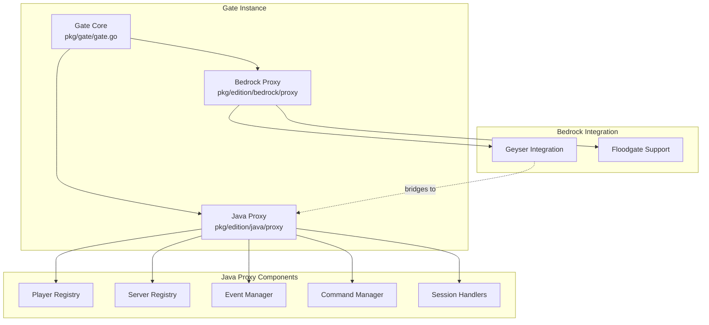

# Architecture Overview

Gate is built with a modular, event-driven architecture that provides high performance and flexibility. This page explains the core components and how they interact.

## High-Level Architecture

Gate consists of several key layers that work together:



## Core Components

### Gate Instance

The root `Gate` struct (`pkg/gate/gate.go:127-132`) orchestrates multiple proxy editions:

```go
type Gate struct {
    javaProxy    *jproxy.Proxy      // Java edition proxy
    bedrockProxy *bproxy.Proxy      // Bedrock edition proxy (optional)
    proc         process.Collection // Parallel running processes
}
```

**Key responsibilities:**
- Manages lifecycle of both Java and Bedrock proxies
- Coordinates startup/shutdown sequences
- Handles configuration loading and validation
- Integrates optional components (Connect API, Web API)

**Initialization flow:**

1. Java proxy is always created (mandatory)
2. Bedrock proxy is created if enabled in config
3. Additional services (Connect, API) are registered
4. All components start in parallel via `process.Collection`

See `pkg/gate/gate.go:45-124` for the complete initialization logic.

### Java Proxy

The `Proxy` struct (`pkg/edition/java/proxy/proxy.go:42-70`) is the heart of the Java edition support:

```go
type Proxy struct {
    log              logr.Logger
    cfg              *config.Config
    event            event.Manager
    command          command.Manager
    channelRegistrar *message.ChannelRegistrar
    authenticator    auth.Authenticator
    
    servers       map[string]*registeredServer // Backend servers
    playerNames   map[string]*connectedPlayer  // Players by name
    playerIDs     map[uuid.UUID]*connectedPlayer // Players by ID
    
    connectionsQuota *addrquota.Quota // Rate limiting
    loginsQuota      *addrquota.Quota
}
```

**Core subsystems:**

#### 1. Player Registry

Tracks all connected players with two indices:
- `playerNames`: Case-insensitive username lookup
- `playerIDs`: UUID-based lookup for guaranteed uniqueness

See `pkg/edition/java/proxy/proxy.go:692-755` for registration/unregistration logic.

#### 2. Server Registry

Manages backend server registrations:
- Servers can be added via config or API
- Config-managed servers are tracked separately
- Supports dynamic registration/unregistration
- Validates server names and addresses

See `pkg/edition/java/proxy/proxy.go:469-523` for server management.

#### 3. Event System

Gate uses a powerful event-driven architecture:
- Events are fired for all significant actions
- Plugins subscribe to events to extend functionality
- Events can be cancelled or modified
- Asynchronous event handling by default

Common events:
- `ConnectionEvent`: New client connection
- `LoginEvent`: Player authentication
- `ServerConnectedEvent`: Player joined backend server
- `DisconnectEvent`: Player disconnected
- `PluginMessageEvent`: Custom protocol messages

See the full event list at `pkg/edition/java/proxy/events.go`.

#### 4. Command System

Built-in command framework with:
- Command registration and routing
- Permission checking
- Tab completion support
- Brigadier-style command trees

### Bedrock Proxy

The Bedrock proxy (`pkg/edition/bedrock/proxy/proxy.go:55-63`) is a lightweight wrapper around Geyser:

```go
type Proxy struct {
    log    logr.Logger
    event  event.Manager
    config *config.Config
    
    geyserIntegration *geyser.Integration
    javaProxy         *jproxy.Proxy // Reference to Java proxy
}
```

**Architecture notes:**
- Bedrock proxy requires Java proxy (mandatory dependency)
- Geyser translates Bedrock protocol to Java protocol
- Floodgate handles authentication for Bedrock players
- All Bedrock players appear as Java players internally

See `pkg/edition/bedrock/proxy/proxy.go:67-126` for startup logic.

## Key Abstractions

### Player Abstraction

The `Player` interface (`pkg/edition/java/proxy/player.go:52-130`) provides a unified API for interacting with connected players:

```go
type Player interface {
    ID() uuid.UUID
    Username() string
    CurrentServer() ServerConnection
    CreateConnectionRequest(target RegisteredServer) ConnectionRequest
    Disconnect(reason component.Component)
    SendMessage(msg component.Component) error
    // ... many more methods
}
```

**Implementation:** `connectedPlayer` (`pkg/edition/java/proxy/player.go:132-168`)

**Key fields:**
- `MinecraftConn`: Network connection wrapper
- `profile`: Game profile (name, UUID, properties)
- `connectedServer_`: Current backend server connection
- `connInFlight`: Server connection being established
- `connPhase`: Current connection phase (handshake, login, play, etc.)

### Server Abstraction

Servers are represented by two key types:

#### ServerInfo

Basic server metadata:

```go
type ServerInfo interface {
    Name() string   // Server identifier
    Addr() net.Addr // TCP address
}
```

See `pkg/edition/java/proxy/server.go:115-119`.

#### RegisteredServer

Full server registration with player tracking:

```go
type RegisteredServer interface {
    ServerInfo
    Players() Players // Connected players
    Ping() (ServerPing, error) // Query server status
}
```

Implementation: `registeredServer` with player list management.

### Connection Abstraction

Gate wraps network connections with `MinecraftConn` which provides:
- Protocol version negotiation
- State management (handshake → login → play)
- Packet compression
- Encryption support
- Read/write timeouts
- Context-aware cancellation

## Session Handlers

Gate uses a state machine pattern for handling different connection phases. Each phase has a dedicated session handler:

| State | Handler | Purpose |
|-------|---------|----------|
| Handshake | `handshakeSessionHandler` | Initial protocol negotiation |
| Status | `statusSessionHandler` | Server list ping responses |
| Login | `initialLoginSessionHandler` | Authentication and profile setup |
| Config | `configSessionHandler` | 1.20.2+ configuration phase |
| Play | `clientPlaySessionHandler` | Active gameplay, packet forwarding |

Handlers are swapped as the connection progresses through states. See `pkg/edition/java/proxy/session_client_handshake.go:46-53` for the base handler structure.

## Thread Safety

Gate is designed for high concurrency:

**Locking strategy:**
- Player registry uses `muP` RWMutex
- Server registry uses `muS` RWMutex
- Individual players have their own mutex for state
- Read-heavy operations use RLock for better performance

**Connection handling:**
- Each connection runs in its own goroutine
- Packet reading is asynchronous
- Event handlers run concurrently (fire and forget)

## Rate Limiting

Gate includes built-in protection against abuse:

**Connection quota** (`connectionsQuota`):
- Limits new connections per IP address
- Configured via `quota.connections` in config
- Checked in `HandleConn` before processing

**Login quota** (`loginsQuota`):
- Limits authentication requests per IP
- Prevents Mojang API abuse
- Configured via `quota.logins` in config

See `pkg/edition/java/proxy/proxy.go:129-143` for quota initialization.

## Configuration Management

Gate supports hot-reload of configuration:

1. Config changes detected via file watch
2. New config is validated
3. `ConfigUpdateEvent` fired with old and new config
4. Components subscribe and apply changes selectively
5. Some changes (like bind address) trigger restarts

See `pkg/gate/gate.go:271-297` for reload implementation.

## Lite Mode

Lite mode (`pkg/edition/java/lite`) is a special routing mode:
- Minimal memory footprint
- No player state tracking
- Direct connection forwarding
- Route-based server selection
- Cached ping responses

When enabled, most proxy features are bypassed for performance. See `pkg/edition/java/proxy/session_client_handshake.go:98-112` for lite mode branching.

## Package Organization

```
pkg/
├── gate/              # Root Gate instance
│   ├── gate.go        # Main orchestrator
│   └── config/        # Configuration structures
├── edition/           # Edition-specific implementations
│   ├── java/
│   │   ├── proxy/     # Java proxy core
│   │   ├── proto/     # Protocol definitions
│   │   ├── netmc/     # Network connection wrapper
│   │   ├── auth/      # Mojang authentication
│   │   ├── config/    # Java-specific config
│   │   └── lite/      # Lite mode implementation
│   └── bedrock/
│       ├── proxy/     # Bedrock proxy wrapper
│       ├── geyser/    # Geyser integration
│       └── config/    # Bedrock-specific config
├── command/           # Command framework
└── util/              # Shared utilities
```

## Next Steps

- [How It Works](/concepts/how-it-works): Learn about connection flow and packet handling
- [Editions](/concepts/editions): Understand Java vs Bedrock support
- [Configuration](/essentials/config): Configure Gate for your needs
