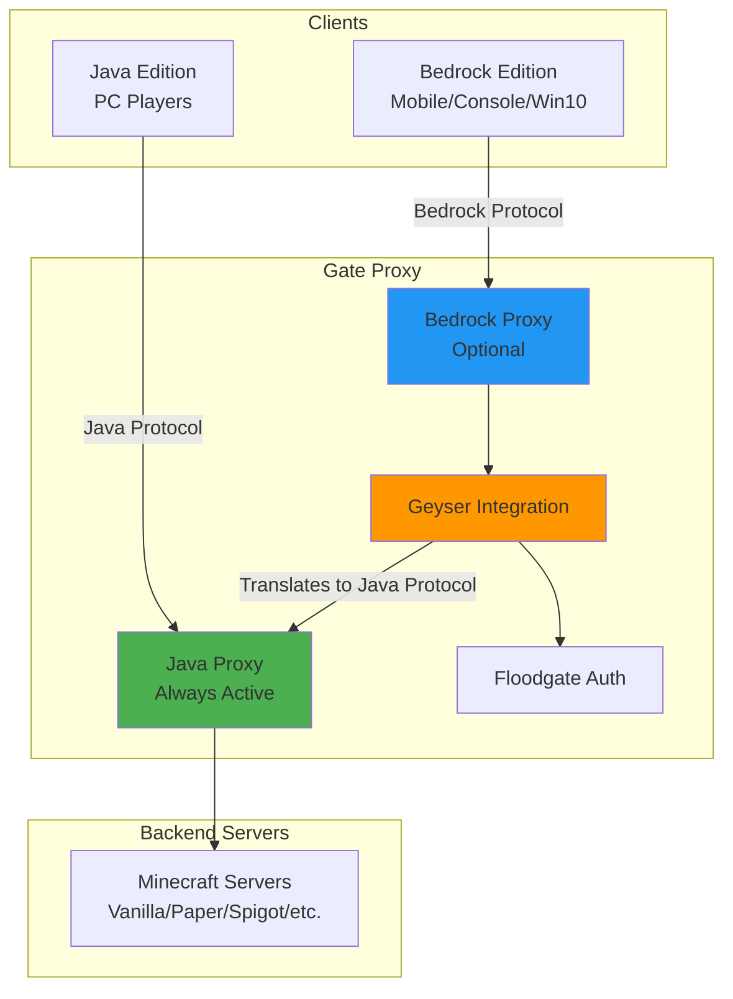

# Minecraft Editions

Gate supports both Java Edition (PC) and Bedrock Edition (Mobile, Console, Windows) Minecraft clients. This page explains how each edition is implemented and how they work together.

## Edition Architecture



## Java Edition

### Overview

Java Edition is the original Minecraft written in Java, primarily played on PC. Gate's Java proxy is the core component and is always active.

**Package:** `pkg/edition/java/proxy`  
**Main struct:** `Proxy` (`proxy.go:42-70`)

### Features

**Full protocol support:**
- Minecraft 1.7.2 through latest version
- Multi-version support (no client mods required)
- Automatic protocol translation
- Forge/Fabric mod support

**Authentication:**
- Online mode (Mojang authentication)
- Offline mode (no authentication)
- Custom authentication servers
- Velocity/BungeeCord forwarding modes

**Advanced features:**
- Plugin messages (custom protocols)
- Boss bars and titles
- Tab list manipulation
- Resource pack management
- Server switching
- Chat handling
- Command system

### Protocol Handling

The Java protocol is complex and version-specific. Gate handles this through:

**State machine:**
```go
Handshake → Status (ping)
          → Login → Config (1.20.2+) → Play
                  → Play (pre-1.20.2)
```

**Version detection:**

Clients send their protocol version in the handshake packet:

```go
type Handshake struct {
    ProtocolVersion int32  // e.g., 763 for 1.20.1
    ServerAddress   string
    Port            uint16
    NextStatus      int32
}
```

Gate maps protocol versions to Minecraft versions and selects the appropriate packet definitions.

See `pkg/edition/java/proto/version` for version mappings.

**Packet registry:**

Each protocol version has different packet IDs. Gate maintains registries that map:
- Packet ID → Packet struct (decoding)
- Packet struct → Packet ID (encoding)

Registries are loaded lazily and cached for performance.

### Session Handlers

Java connections use dedicated session handlers for each phase:

| Handler | File | Purpose |
|---------|------|----------|
| `handshakeSessionHandler` | `session_client_handshake.go` | Initial handshake |
| `statusSessionHandler` | `session_status.go` | Server list ping |
| `initialLoginSessionHandler` | `session_client_initial_login.go` | Authentication |
| `configSessionHandler` | `session_client_config.go` | 1.20.2+ config phase |
| `clientPlaySessionHandler` | `session_client_play.go` | Active gameplay |
| `backendPlaySessionHandler` | `session_backend_play.go` | Backend connection |

### Forge/Fabric Support

Gate supports modded clients:

**Forge:**
- Legacy Forge (1.7-1.12)
- Modern Forge (1.13+)
- Forge handshake protocol
- Mod list exchange

**Fabric:**
- No special handling required
- Works like vanilla

**Implementation:** Gate detects Forge clients through the handshake and adjusts packet handling accordingly.

See `pkg/edition/java/forge` for Forge-specific code.

## Bedrock Edition

### Overview

Bedrock Edition is the C++ rewrite of Minecraft, used on:
- Mobile (iOS, Android)
- Consoles (Xbox, PlayStation, Nintendo Switch)
- Windows 10/11 (Microsoft Store version)

Gate supports Bedrock through **Geyser**, a protocol translator.

**Package:** `pkg/edition/bedrock/proxy`  
**Main struct:** `Proxy` (`proxy.go:55-63`)

### Geyser Integration

Geyser is a third-party bridge that translates between Bedrock and Java protocols. Gate integrates Geyser in two modes:

#### 1. External Geyser

Run Geyser as a separate process:

```yaml
bedrock:
  enabled: true
  geyserListenAddr: "0.0.0.0:19132" # Bedrock port
  managed:
    enabled: false  # Use external Geyser
```

Gate connects to Geyser via the Java protocol. Bedrock players appear as Java players to Gate.

#### 2. Managed Geyser (Embedded)

Gate can download and manage Geyser automatically:

```yaml
bedrock:
  enabled: true
  managed:
    enabled: true
    jarUrl: "https://download.geysermc.org/v2/projects/geyser/versions/latest/builds/latest/downloads/standalone"
    configOverrides:
      bedrock:
        port: 19132
```

**How it works:**
1. Gate downloads Geyser JAR on first start
2. Generates Geyser config with overrides
3. Starts Geyser as a subprocess
4. Geyser connects back to Gate's Java proxy
5. Gate manages Geyser lifecycle (start/stop/reload)

See `pkg/edition/bedrock/geyser/integration.go` for implementation.

### Floodgate Authentication

Floodgate allows Bedrock players to join without a Java account:

**How it works:**

1. Bedrock player authenticates with Xbox Live
2. Geyser validates Xbox authentication
3. Geyser generates a profile for the player
4. Geyser uses Floodgate's encryption key to sign the profile
5. Gate receives the player via Java protocol
6. Gate validates Floodgate signature
7. Player is allowed in without Mojang authentication

**Username format:**

Bedrock players have a prefix to distinguish them:

```yaml
bedrock:
  usernameFormat: ".{username}"  # e.g., ".Steve" for Bedrock Steve
```

This prevents name conflicts with Java players.

**Configuration:**

```yaml
bedrock:
  enabled: true
  floodgateKeyPath: "/path/to/key.pem"  # Shared with Geyser
  usernameFormat: ".{username}"
```

The key must match Geyser's configuration.

### Protocol Differences

Java and Bedrock protocols are fundamentally different:

| Aspect | Java | Bedrock |
|--------|------|----------|
| **Transport** | TCP | UDP (RakNet) |
| **Packets** | Variable-length | Fixed structures |
| **Encryption** | AES/CFB8 | AES/GCM |
| **Compression** | zlib | None (RakNet handles it) |
| **Block IDs** | Namespaced IDs | Numeric runtime IDs |
| **Items** | NBT tags | Complex item structures |
| **Auth** | Mojang | Xbox Live |

**Geyser's role:** Translate all these differences in real-time.

### Limitations

Some features don't translate perfectly:

**Java → Bedrock:**
- Some custom items may not display correctly
- Chat formatting differences
- Some particles/effects missing
- Redstone timing differences

**Bedrock → Java:**
- Some Bedrock-exclusive items unsupported
- Emotes don't translate
- Some touch controls require adaptation

Most gameplay works seamlessly, but edge cases exist.

### Bedrock Proxy Implementation

The Bedrock proxy (`pkg/edition/bedrock/proxy/proxy.go`) is minimal:

```go
type Proxy struct {
    log    logr.Logger
    event  event.Manager
    config *config.Config
    
    geyserIntegration *geyser.Integration
    javaProxy         *jproxy.Proxy // Required!
}
```

**Key points:**
- Bedrock proxy **requires** Java proxy (mandatory dependency)
- It's primarily a wrapper around Geyser integration
- Most logic is delegated to Geyser
- Gate sees all Bedrock players as Java players internally

**Lifecycle:**

1. Java proxy starts first
2. Bedrock proxy initializes Geyser
3. Geyser starts and connects to Java proxy
4. Bedrock players can now connect

See `proxy.go:67-126` for startup implementation.

## Cross-Play Configuration

To enable cross-play between Java and Bedrock:

### Basic Setup

```yaml
# Gate config.yml
bind: 0.0.0.0:25565  # Java port

bedrock:
  enabled: true
  managed:
    enabled: true
  geyserListenAddr: "0.0.0.0:19132"  # Bedrock port
  usernameFormat: ".{username}"
```

**Result:**
- Java players connect to `your-server.com:25565`
- Bedrock players connect to `your-server.com:19132`
- Both see each other in-game

### Advanced Configuration

```yaml
bedrock:
  enabled: true
  
  # Managed Geyser
  managed:
    enabled: true
    jarUrl: "https://download.geysermc.org/v2/projects/geyser/versions/latest/builds/latest/downloads/standalone"
    workingDir: "/opt/gate/geyser"
    configOverrides:
      bedrock:
        address: "0.0.0.0"
        port: 19132
      remote:
        address: "127.0.0.1"
        port: 25565  # Connect back to Gate
      auth-type: floodgate
  
  # Floodgate settings
  floodgateKeyPath: "/opt/gate/geyser/key.pem"
  usernameFormat: "*{username}"  # Prefix with *
  
  # Network
  geyserListenAddr: "0.0.0.0:19132"
```

## Edition Detection

Gate automatically detects which edition a player is using:

**Java players:**
- Direct connection to Gate
- `Player.Protocol()` returns Java protocol version
- No special prefix in username

**Bedrock players:**
- Connection via Geyser
- Appear as Java players with special properties
- Username has configured prefix
- Can detect via Floodgate data

**Code example:**

```go
func isBedrockPlayer(player proxy.Player) bool {
    // Check username prefix
    return strings.HasPrefix(player.Username(), ".")
    
    // Or check Floodgate data
    // (requires additional Floodgate integration)
}
```

## Backend Server Requirements

Backend servers must support both editions:

**For Java players:**
- Any vanilla/Paper/Spigot/etc. server works
- No special configuration needed

**For Bedrock players:**
- Server must not have authentication
- Use Floodgate plugin/mod if you need player data
- Set `online-mode=false` in server.properties
- Configure player forwarding (Velocity/BungeeCord)

**Recommended setup:**

1. Set `online-mode=false` on backend servers
2. Enable Velocity forwarding on Gate
3. Install Velocity support on Paper servers
4. Optionally install Floodgate on backends for Bedrock player detection

## Performance Considerations

**Java Edition:**
- Minimal overhead (~2-5ms latency)
- Direct packet forwarding
- Protocol translation is fast

**Bedrock Edition:**
- Additional overhead from Geyser (~5-15ms)
- UDP → TCP conversion
- Complex protocol translation
- More CPU usage (Geyser runs in separate JVM)

**Recommendations:**
- Use dedicated server for large Bedrock player counts
- Consider external Geyser for better resource isolation
- Monitor Geyser memory usage (separate from Gate)

## Next Steps

- [Bedrock Setup Guide](/guide/bedrock): Configure Bedrock support
- [Configuration Reference](/essentials/config): All configuration options
- [Architecture](/concepts/architecture): Learn about Gate's internals
