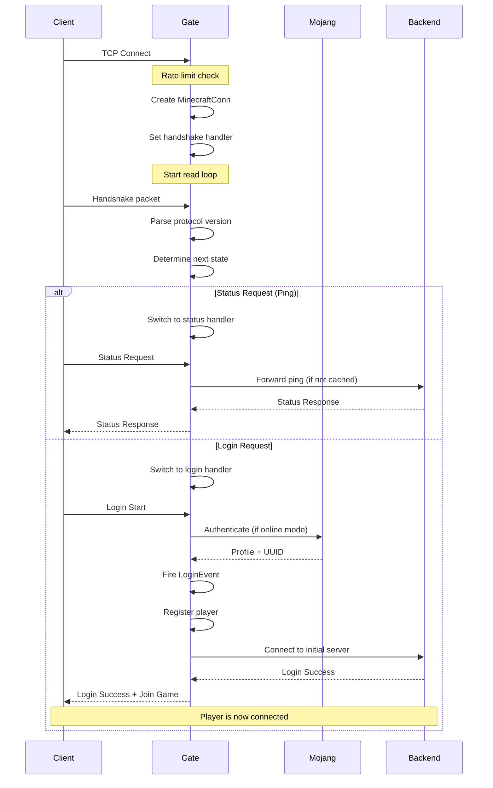
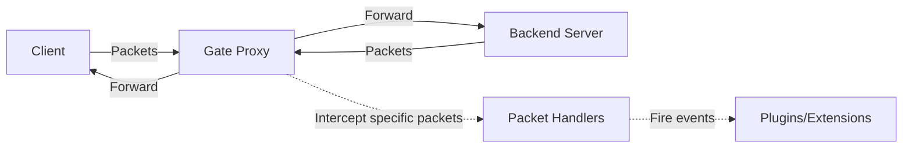
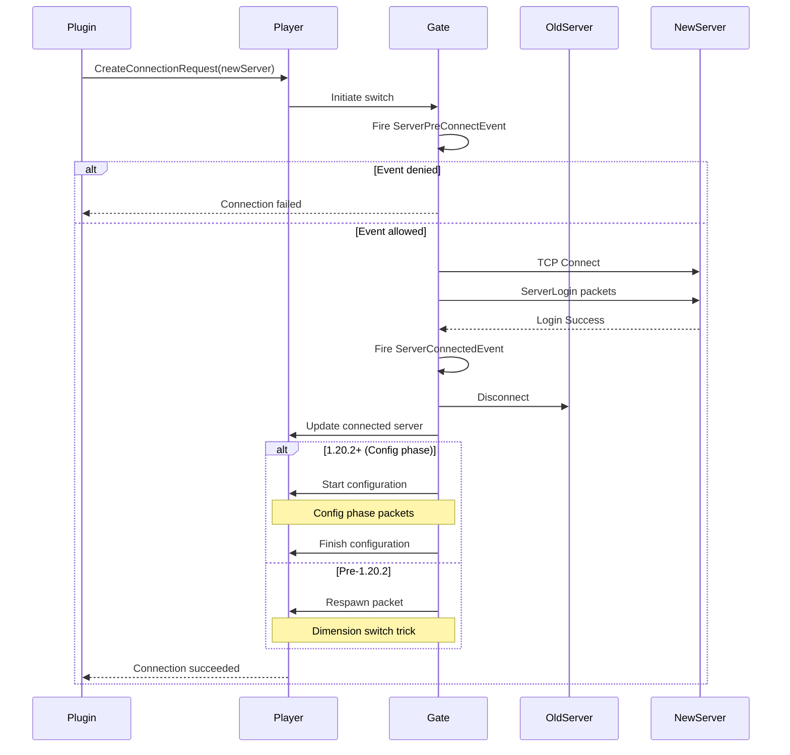
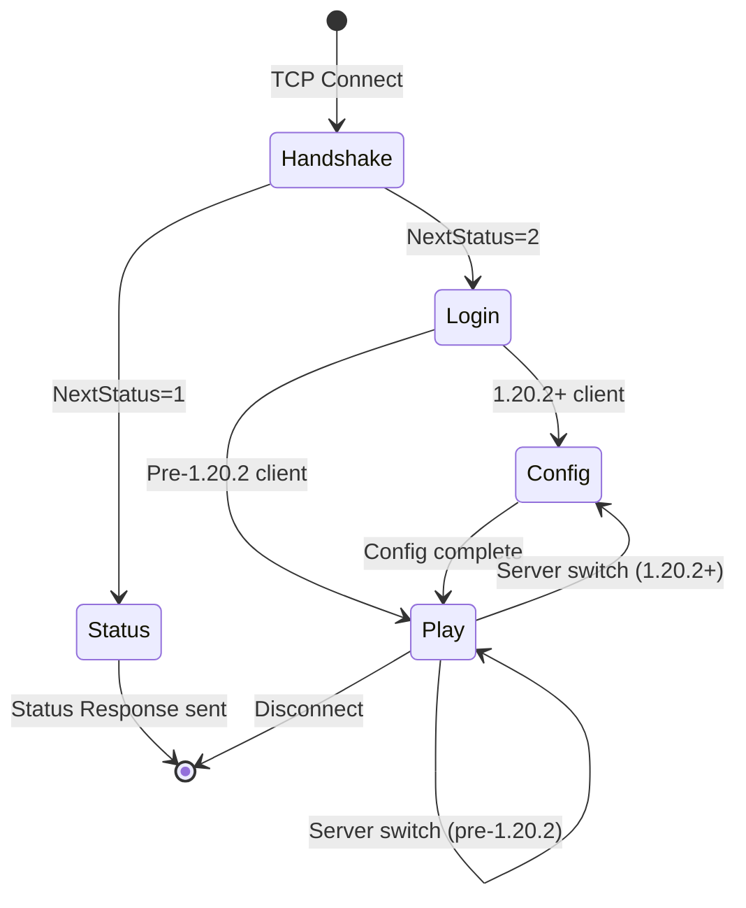

# How Gate Works

This page explains the internal mechanics of Gate: how connections are established, how packets flow through the proxy, and how players move between servers.

## Connection Lifecycle

### 1. Initial Connection

When a client connects to Gate, the following sequence occurs:



**Code path:**
1. `Proxy.listenAndServe()` accepts connection (`pkg/edition/java/proxy/proxy.go:543-582`)
2. `Proxy.HandleConn()` checks rate limits (`proxy.go:584-640`)
3. `MinecraftConn` is created with handshake handler
4. `handshakeSessionHandler.HandlePacket()` processes handshake (`pkg/edition/java/proxy/session_client_handshake.go:67-136`)

### 2. Handshake Phase

The handshake is the first packet sent by any Minecraft client:

```go
type Handshake struct {
    ProtocolVersion int32  // Client's protocol version
    ServerAddress   string // Hostname client connected to
    Port            uint16 // Port client connected to
    NextStatus      int32  // Intended next state (1=status, 2=login)
}
```

Gate uses this packet to:
- Determine client protocol version
- Extract virtual host (for forced hosts)
- Decide whether to enter status or login flow
- Check version compatibility

**Virtual host resolution:**

The `ServerAddress` field allows Gate to implement "forced hosts" - routing players to different servers based on the domain they connected to:

```yaml
forcedHosts:
  lobby.example.com:
    - lobby
  survival.example.com:
    - survival
```

See `pkg/edition/java/proxy/session_client_handshake.go:114-118` for virtual host parsing.

### 3. Status Phase (Server Ping)

When `NextStatus = 1`, the client wants server status:

**Flow:**
1. Switch to `statusSessionHandler`
2. Wait for `StatusRequest` packet
3. Resolve ping response:
   - In normal mode: forward to a backend server
   - In lite mode: use cached response or route-based resolution
4. Fire `ProxyPingEvent` to allow modification
5. Send `StatusResponse` to client
6. Optionally handle `StatusPing` (latency measurement)

**Code:** `pkg/edition/java/proxy/session_status.go`

### 4. Login Phase

When `NextStatus = 2`, the client wants to join:

#### Step 4.1: Version Check

Gate first validates the client's protocol version:

```go
if !version.Protocol(p.ProtocolVersion).Supported() {
    inbound.disconnect(&component.Translation{
        Key:  "multiplayer.disconnect.outdated_client",
        With: []component.Component{&component.Text{Content: version.SupportedVersionsString}},
    })
    return
}
```

Gate supports Minecraft 1.7.2 through the latest version.

#### Step 4.2: Rate Limiting

Login quota prevents authentication spam:

```go
if h.loginsQuota != nil && h.loginsQuota.Blocked(netutil.Host(inbound.RemoteAddr())) {
    netmc.CloseWith(h.conn, packet.NewDisconnect(&component.Text{
        Content: "You are logging in too fast, try again later.",
    }))
    return
}
```

See `pkg/edition/java/proxy/session_client_handshake.go:149-154`.

#### Step 4.3: Pre-Authentication Event

The `PreLoginEvent` fires before authentication:

```go
preLogin := &PreLoginEvent{
    conn:     inbound,
    username: login.Username,
}
h.eventMgr.Fire(preLogin)
```

Plugins can:
- Deny the login
- Force offline mode for this player
- Set a custom reason for denial

#### Step 4.4: Authentication

In online mode, Gate authenticates with Mojang:

```go
profile, err := h.auth().Authenticate(ctx, &auth.AuthenticateRequest{
    Username:    login.Username,
    ServerID:    serverID,
    RemoteAddr:  inbound.RemoteAddr(),
    ProtocolVersion: h.conn.Protocol(),
})
```

This calls the Mojang session server (`hasJoined` endpoint) to:
1. Verify the player owns the account
2. Retrieve their UUID and profile
3. Fetch skin/cape properties

**Offline mode:** UUID is generated deterministically from username.

See `pkg/edition/java/auth/authenticator.go` for authentication logic.

#### Step 4.5: LoginEvent

The `LoginEvent` allows plugins to:
- Deny the login
- Set initial server
- Modify game profile

```go
event := &LoginEvent{
    player:        player,
    onlineMode:    onlineMode,
    initialServer: initialServer,
}
h.eventMgr.Fire(event)
```

#### Step 4.6: Player Registration

Gate attempts to register the player:

```go
if !h.proxy.registerConnection(player) {
    player.Disconnect(&component.Translation{
        Key: "multiplayer.disconnect.duplicate_login",
    })
    return
}
```

In online mode with `onlineModeKickExistingPlayers: true`, existing connections are kicked to allow the new one.

See `pkg/edition/java/proxy/proxy.go:704-745`.

#### Step 4.7: Initial Server Connection

Finally, Gate connects the player to their initial backend server (determined by config or `LoginEvent`):

```go
srvConn, err := player.createServerConnection(initialServer)
if err != nil {
    player.Disconnect(internalServerConnectionError)
    return
}
```

This establishes a backend connection, performs server-side login, and transitions the player to the Play state.

### 5. Play Phase

Once connected to a backend server, Gate enters "passthrough mode":



**Key handlers:**
- `clientPlaySessionHandler`: Handles client → backend packets
- `backendPlaySessionHandler`: Handles backend → client packets

**Intercepted packets:**

Gate selectively intercepts certain packets for special handling:

| Packet | Direction | Purpose |
|--------|-----------|----------|
| `PluginMessage` | Both | Custom protocol, server switching |
| `Disconnect` | Backend → Client | Track disconnects, try fallback servers |
| `TabCompleteRequest/Response` | Both | Command completion |
| `ClientSettings` | Client → Backend | Track player preferences |
| `KeepAlive` | Both | Connection health monitoring |
| `Chat` | Client → Backend | Command interception |

Most packets are forwarded directly without parsing for performance.

See `pkg/edition/java/proxy/session_client_play.go` and `session_backend_play.go`.

## Server Switching

One of Gate's most powerful features is seamless server switching:

### Server Switch Flow



**Code path:**

1. `player.CreateConnectionRequest(server)` creates a `ConnectionRequest`
2. `ConnectionRequest.Connect()` or `ConnectWithIndication()` initiates the switch
3. Gate validates the target server exists
4. `ServerPreConnectEvent` fires (can be denied or redirected)
5. New server connection is established
6. `ServerConnectedEvent` fires
7. Old connection is gracefully closed
8. Player's `connectedServer_` field is updated
9. Client receives respawn/config packets to switch dimension

**Respawn trick:** For pre-1.20.2 clients, Gate sends a respawn packet with a temporary dimension, then immediately respawns in the correct dimension. This forces the client to reload the world.

**1.20.2+ configuration phase:** Modern clients use a dedicated configuration phase for seamless server switches.

See `pkg/edition/java/proxy/server.go` and `pkg/edition/java/proxy/session_backend_transition.go` for implementation.

## Packet Handling Architecture

Gate uses a layered approach to packet handling:

### Layer 1: Network (netmc)

The `netmc` package provides low-level packet I/O:

```go
type MinecraftConn interface {
    WritePacket(packet proto.Packet) error
    BufferPacket(packet proto.Packet) error
    Flush() error
    Close() error
    
    State() *state.Registry
    SetState(state *state.Registry)
    Protocol() proto.Protocol
    SetProtocol(protocol proto.Protocol)
}
```

**Responsibilities:**
- Packet framing (length prefix)
- Compression (zlib)
- Encryption (AES/CFB8)
- Protocol version mapping
- Connection state management

### Layer 2: Protocol (proto)

The `proto` package defines packet structures:

```go
type Packet interface {
    Encode(*proto.PacketContext, io.Writer) error
    Decode(*proto.PacketContext, io.Reader) error
}
```

Each Minecraft packet has a corresponding Go struct. Examples:
- `packet.Handshake`
- `packet.StatusRequest`/`StatusResponse`
- `packet.LoginStart`/`LoginSuccess`
- `packet.JoinGame`
- `packet.PluginMessage`

### Layer 3: Session Handlers

Session handlers process parsed packets:

```go
type SessionHandler interface {
    HandlePacket(pc *proto.PacketContext)
    Disconnected()
}
```

Each connection state has a dedicated handler:
- `handshakeSessionHandler`
- `statusSessionHandler`
- `initialLoginSessionHandler`
- `clientPlaySessionHandler`
- `backendPlaySessionHandler`

Handlers are swapped as the connection progresses through states.

### Layer 4: Event System

Significant actions trigger events:

```go
type LoginEvent struct {
    player        Player
    onlineMode    bool
    initialServer RegisteredServer
    result        LoginResult // Allow/Deny
}
```

Plugins subscribe to events and can modify behavior.

## Connection State Machine

Each connection progresses through states:



**State registry:** Gate maintains a `state.Registry` that maps:
- Packet ID → Packet struct for decoding
- Packet struct → Packet ID for encoding

Registries are protocol-version specific and switch based on the handshake.

## Performance Optimizations

### Zero-Copy Packet Forwarding

For packets that don't need inspection, Gate uses zero-copy forwarding:

```go
// Buffer packet without parsing
conn.BufferPacket(unknownPacket)
```

This avoids allocating memory for packet structs.

### Connection Pooling

Backend connections use connection pooling to reduce latency on server switches.

### Lite Mode Fast Path

When lite mode is enabled:
1. No player state tracking
2. Direct connection piping
3. Cached ping responses
4. Route-based server selection

This provides minimal overhead for simple forwarding use cases.

See `pkg/edition/java/lite/forward.go`.

### Asynchronous Event Handling

Events are fired asynchronously:

```go
eventMgr.Fire(event) // Non-blocking
```

Event handlers run in separate goroutines, preventing slow handlers from blocking packet processing.

## Error Handling

Gate employs graceful error handling:

**Connection errors:**
- Network errors → clean disconnect
- Protocol errors → disconnect with reason
- Timeout errors → keep-alive checks

**Backend server errors:**
- Connection failed → try fallback servers
- Disconnected during play → return to lobby
- Config error → disconnect with admin notification

**Fallback logic:**

When a backend server connection fails or disconnects:

1. Check if player has a fallback server list
2. Try each server in order
3. If all fail, disconnect player with reason

See `pkg/edition/java/proxy/player.go` disconnect handling.

## Next Steps

- [Architecture](/concepts/architecture): Learn about Gate's component structure
- [Editions](/concepts/editions): Understand Java vs Bedrock support
- [Events Reference](/api-reference/events): See all available events
