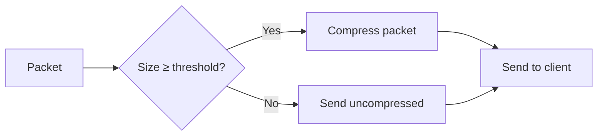

# Compression Configuration

Gate supports packet compression to reduce bandwidth usage between the proxy and connected clients. Configure compression thresholds and levels to balance bandwidth savings against CPU usage.

## Overview

Minecraft protocol supports packet compression using zlib. When enabled, packets larger than a threshold are compressed before transmission, reducing network bandwidth at the cost of CPU resources.

<Info>
  **Important**: These settings apply to **Gate ↔ Client** connections only. Compression between Gate and backend servers is controlled by the backend server's configuration.
</Info>

## Configuration

<ParamField path="config.compression" type="object">
  Packet compression settings
  
  ```yaml
  compression:
    threshold: 256  # Minimum packet size to compress (bytes)
    level: -1       # Compression level (-1 to 9)
  ```
</ParamField>

## Compression Threshold

<ParamField path="config.compression.threshold" type="integer" default="256">
  The minimum size (in bytes) a packet must be before Gate compresses it. The vanilla Minecraft server uses 256 by default.
  
  ```yaml
  compression:
    threshold: 256
  ```
</ParamField>

### How Threshold Works



- **Packets ≥ threshold**: Compressed before sending
- **Packets < threshold**: Sent uncompressed (compression overhead not worth it)

### Threshold Values

<Tabs>
  <Tab title="Default (256)">
    ```yaml
    compression:
      threshold: 256  # Vanilla Minecraft default
    ```
    
    **Best for**: Most servers
    
    - Balanced bandwidth/CPU tradeoff
    - Same as vanilla Minecraft
    - Good for typical gameplay
    - Recommended starting point
  </Tab>
  
  <Tab title="Lower (64-128)">
    ```yaml
    compression:
      threshold: 64  # More aggressive compression
    ```
    
    **Best for**: Low bandwidth connections
    
    **Pros**:
    - Compresses more packets
    - Saves more bandwidth
    - Better for slow connections
    
    **Cons**:
    - Higher CPU usage
    - May reduce throughput
    - Diminishing returns for small packets
  </Tab>
  
  <Tab title="Higher (512-1024)">
    ```yaml
    compression:
      threshold: 1024  # Less aggressive compression
    ```
    
    **Best for**: High bandwidth, CPU-constrained environments
    
    **Pros**:
    - Lower CPU usage
    - Higher throughput
    - Less compression overhead
    
    **Cons**:
    - Uses more bandwidth
    - Fewer packets compressed
  </Tab>
  
  <Tab title="Disabled (-1)">
    ```yaml
    compression:
      threshold: -1  # Disable compression
    ```
    
    **Best for**: Testing or LAN environments
    
    **Pros**:
    - Zero compression overhead
    - Maximum throughput
    - Lowest CPU usage
    
    **Cons**:
    - Maximum bandwidth usage
    - Not recommended for internet
  </Tab>
  
  <Tab title="Always On (0)">
    ```yaml
    compression:
      threshold: 0  # Compress all packets
    ```
    
    **Best for**: Extremely limited bandwidth
    
    **Pros**:
    - Maximum bandwidth savings
    
    **Cons**:
    - Very high CPU usage
    - Lower throughput
    - Compresses tiny packets (inefficient)
    - Not recommended
  </Tab>
</Tabs>

<Warning>
  Setting `threshold: 0` compresses **all** packets including tiny ones, significantly increasing CPU usage with minimal bandwidth benefit. Only use in extreme bandwidth-constrained scenarios.
</Warning>

## Compression Level

<ParamField path="config.compression.level" type="integer" default="-1">
  The zlib compression level. Goes from -1 to 9 where:
  - `-1` = Default (zlib chooses, usually equivalent to 6)
  - `0` = No compression
  - `1` = Fastest, least compression
  - `6` = Balanced (zlib default)
  - `9` = Slowest, most compression
  
  ```yaml
  compression:
    level: -1
  ```
</ParamField>

### Level Comparison

| Level | Speed      | Compression | CPU Usage | Use Case                          |
| ----- | ---------- | ----------- | --------- | --------------------------------- |
| `-1`  | Default    | Default     | Medium    | **Recommended** - Let zlib decide |
| `0`   | Instant    | None        | Minimal   | Testing only                      |
| `1`   | Very Fast  | Low         | Low       | High throughput priority          |
| `3`   | Fast       | Good        | Low-Med   | Good balance                      |
| `6`   | Medium     | Good        | Medium    | Zlib default                      |
| `9`   | Slow       | Best        | High      | Bandwidth priority                |

### Choosing Compression Level

<CodeGroup>
```yaml Default (Recommended)
compression:
  level: -1  # Let zlib choose optimal level
```

```yaml Fast (Low CPU)
compression:
  level: 1  # Fastest compression
  # Use when: CPU constrained, high player count
```

```yaml Balanced
compression:
  level: 6  # Zlib default
  # Use when: Standard servers, good hardware
```

```yaml Maximum Compression
compression:
  level: 9  # Maximum compression
  # Use when: Bandwidth extremely limited
  # Warning: High CPU usage!
```

```yaml No Compression
compression:
  level: 0
  # Disables compression (use threshold: -1 instead)
```
</CodeGroup>

<Tip>
  **Recommendation**: Use `level: -1` (default) unless you have specific needs. The zlib library automatically chooses optimal settings.
</Tip>

## Validation Warnings

Gate validates compression settings on startup:

### Level Validation

```yaml
# ❌ Invalid level
compression:
  level: 15
# Error: "Unsupported compression level 15: must be -1..9"

# ⚠️ Warning: No compression
compression:
  level: 0
# Warning: "All packets going through the proxy will be uncompressed, 
#           this increases bandwidth usage."
```

### Threshold Validation

```yaml
# ❌ Invalid threshold
compression:
  threshold: -5
# Error: "Invalid compression threshold -5: must be >= -1"

# ⚠️ Warning: Compress everything
compression:
  threshold: 0
# Warning: "All packets going through the proxy will be compressed, 
#           this lowers bandwidth, but has lower throughput and 
#           increases CPU usage."
```

## Configuration Examples

### Standard Server (Recommended)

```yaml config.yml
config:
  bind: 0.0.0.0:25565
  
  servers:
    lobby: localhost:25566
    survival: localhost:25567
  
  try:
    - lobby
  
  # Vanilla Minecraft compression settings
  compression:
    threshold: 256  # Same as vanilla
    level: -1       # Let zlib decide
```

### High-Performance Server

Optimized for low latency and high throughput:

```yaml config.yml
config:
  compression:
    threshold: 512  # Compress fewer packets
    level: 1        # Fast compression
  
  # These settings prioritize:
  # - Lower CPU usage
  # - Higher throughput  
  # - Lower latency
  # At the cost of higher bandwidth usage
```

### Bandwidth-Constrained Server

Optimized for minimal bandwidth usage:

```yaml config.yml
config:
  compression:
    threshold: 64   # Compress more packets
    level: 9        # Maximum compression
  
  # These settings prioritize:
  # - Lower bandwidth usage
  # At the cost of:
  # - Higher CPU usage
  # - Lower throughput
  # - Slightly higher latency
```

### LAN Server

No compression needed on fast local network:

```yaml config.yml
config:
  bind: 0.0.0.0:25565
  
  compression:
    threshold: -1   # Disable compression
    level: -1
  
  # Appropriate for:
  # - LAN parties
  # - Local network play
  # - Development/testing
```

### Large Network

Balanced settings for large server with many players:

```yaml config.yml
config:
  compression:
    threshold: 256  # Standard vanilla threshold
    level: 3        # Lower level to save CPU with many players
  
  # Balances:
  # - CPU usage (important with 100+ players)
  # - Bandwidth usage
  # - Throughput
```

## Performance Considerations

### CPU Impact

<AccordionGroup>
  <Accordion title="Compression uses CPU">
    Every compressed packet requires CPU time:
    
    - **Higher level** = More CPU per packet
    - **Lower threshold** = More packets compressed
    - **More players** = More total packets
    
    Monitor CPU usage and adjust accordingly.
  </Accordion>
  
  <Accordion title="Per-player CPU cost">
    Compression happens per-player connection:
    
    ```
    Total CPU = Players × Packets/sec × Compression Cost
    ```
    
    With many players, even small per-packet overhead adds up.
  </Accordion>
  
  <Accordion title="CPU vs Bandwidth tradeoff">
    - **Lower threshold + higher level** = Less bandwidth, more CPU
    - **Higher threshold + lower level** = More bandwidth, less CPU
    
    Choose based on your bottleneck (bandwidth or CPU).
  </Accordion>
</AccordionGroup>

### Bandwidth Impact

<Accordion title="Compression ratios">
  Typical compression ratios for Minecraft packets:
  
  - **Chunk data**: 3:1 to 5:1 ratio (excellent compression)
  - **Entity updates**: 1.5:1 to 2:1 ratio (moderate compression)
  - **Small packets**: Less than 1.5:1 ratio (poor compression, overhead not worth it)
  
  Most bandwidth savings come from compressing large chunk packets.
</Accordion>

### Throughput Impact

<Accordion title="Compression adds latency">
  Compression/decompression takes time:
  
  - **Level 1**: ~0.1ms per packet
  - **Level 6**: ~0.5ms per packet  
  - **Level 9**: ~2ms per packet
  
  Usually negligible but can add up with high packet rates.
</Accordion>

## Benchmarking

Test different settings to find optimal configuration:

### Monitor CPU Usage

```bash
# Monitor Gate process CPU
top -p $(pgrep gate)

# Or use htop
htop -p $(pgrep gate)
```

### Monitor Bandwidth

```bash
# Monitor network bandwidth
iftop -i eth0

# Or use nload
nload eth0

# Check data transfer
netstat -i
```

### Testing Methodology

<Steps>
  <Step title="Baseline test">
    Start with default settings and measure:
    - CPU usage
    - Bandwidth usage  
    - Player experience (lag)
  </Step>
  
  <Step title="Adjust one setting">
    Change either threshold OR level (not both):
    ```yaml
    compression:
      threshold: 128  # Test lower threshold
      level: -1       # Keep default level
    ```
  </Step>
  
  <Step title="Measure impact">
    Monitor for at least 30 minutes with typical player load
  </Step>
  
  <Step title="Compare results">
    Did CPU/bandwidth/experience improve?
  </Step>
  
  <Step title="Iterate">
    Test other values and compare
  </Step>
</Steps>

## Best Practices

<AccordionGroup>
  <Accordion title="Start with defaults">
    ```yaml
    compression:
      threshold: 256
      level: -1
    ```
    
    Only change if you have measurable issues with bandwidth or CPU.
  </Accordion>
  
  <Accordion title="Match your bottleneck">
    - **CPU constrained**: Higher threshold (512-1024), lower level (1-3)
    - **Bandwidth constrained**: Lower threshold (64-128), higher level (6-9)
    - **Balanced**: Use defaults
  </Accordion>
  
  <Accordion title="Consider player count">
    ```yaml
    # Small server (1-20 players)
    compression:
      threshold: 256
      level: 6  # Can afford higher compression
    
    # Large server (100+ players)  
    compression:
      threshold: 256
      level: 1  # Save CPU with more players
    ```
  </Accordion>
  
  <Accordion title="Test under load">
    Always test compression changes during peak hours with real player load. Synthetic tests don't reflect real-world usage.
  </Accordion>
  
  <Accordion title="Monitor after changes">
    Watch CPU and bandwidth for at least a few hours after changing settings to see the true impact.
  </Accordion>
</AccordionGroup>

## Troubleshooting

<AccordionGroup>
  <Accordion title="High CPU usage">
    **Symptoms**: Gate process using excessive CPU
    
    **Solutions**:
    1. Increase threshold: `threshold: 512` or `threshold: 1024`
    2. Lower compression level: `level: 1` or `level: 3`
    3. Check if issue persists with compression disabled: `threshold: -1`
    
    **Verify it's compression**:
    ```bash
    # Profile Gate process
    perf top -p $(pgrep gate)
    
    # Look for zlib/compression functions
    ```
  </Accordion>
  
  <Accordion title="High bandwidth usage">
    **Symptoms**: Excessive network traffic
    
    **Solutions**:
    1. Lower threshold: `threshold: 128` or `threshold: 64`  
    2. Increase compression level: `level: 6` or `level: 9`
    3. Verify backend servers also use compression
    
    **Monitor impact**:
    ```bash
    # Watch bandwidth before and after
    iftop -i eth0
    ```
  </Accordion>
  
  <Accordion title="Players experiencing lag">
    **Symptoms**: High latency, rubber-banding
    
    **Check if compression related**:
    ```yaml
    # Temporarily disable compression
    compression:
      threshold: -1
    ```
    
    If lag improves, compression was the issue. Otherwise, problem is elsewhere (backend servers, network, etc.).
  </Accordion>
  
  <Accordion title="Configuration not applying">
    **Issue**: Changed settings but no effect
    
    **Solutions**:
    1. Restart Gate (config reload may not apply compression settings)
    2. Check for validation errors in logs
    3. Verify YAML syntax is correct
    
    ```bash
    # Restart Gate
    systemctl restart gate
    
    # Check logs
    journalctl -u gate -f
    ```
  </Accordion>
</AccordionGroup>

## Backend Server Compression

<Info>
  Gate's compression settings only apply to **Gate ↔ Client** connections. The **Gate ↔ Backend** compression is controlled by backend server settings.
</Info>

### Backend Configuration

In backend server's `server.properties`:

```properties
# Vanilla server compression
network-compression-threshold=256
```

This controls compression between Gate and the backend. Consider:

- **LAN backends**: Disable compression (`threshold=-1`) to save CPU
- **Remote backends**: Keep compression enabled to save bandwidth
- **Match Gate settings**: Use same threshold for consistency

## Related Configuration

<CardGroup cols={2}>
  <Card title="Overview" icon="gear" href="/configuration/overview">
    Complete configuration overview
  </Card>
  <Card title="Servers" icon="server" href="/configuration/servers">
    Configure backend servers and timeouts
  </Card>
  <Card title="Forwarding" icon="share-nodes" href="/configuration/forwarding">
    Player info forwarding configuration
  </Card>
  <Card title="Performance" icon="gauge-high" href="/guide/performance">
    Performance tuning and optimization
  </Card>
</CardGroup>