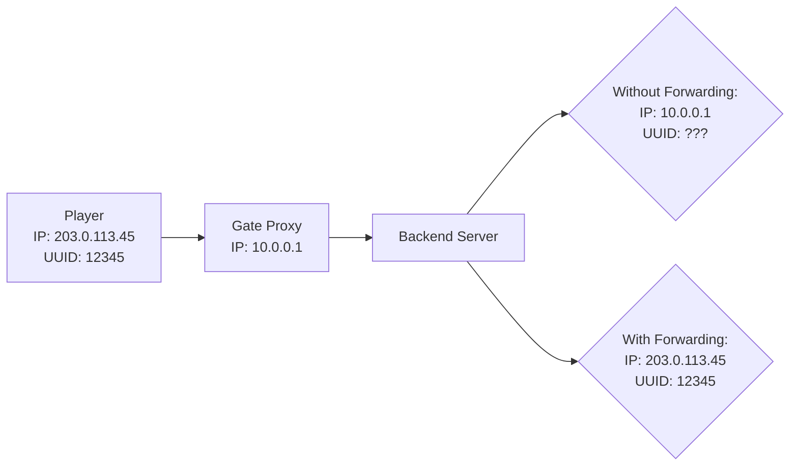
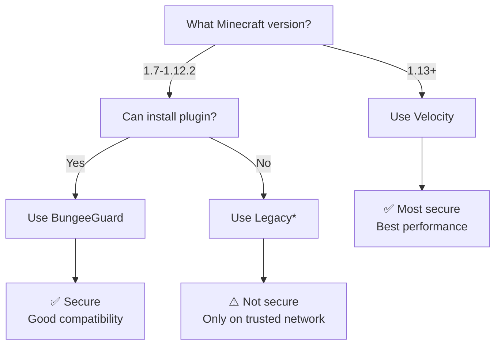

# Player Info Forwarding Configuration

Player info forwarding allows Gate to pass real player information (IP addresses and UUIDs) to backend Minecraft servers. Without forwarding, backend servers only see Gate's IP address for all players.

## Why Forwarding Matters

When players connect through a proxy:



**Without forwarding**, backend servers:
- See Gate's IP for all players (breaks IP bans, geolocation)
- Can't verify player UUIDs (breaks bans, permissions, player data)
- Can't distinguish between players

**With forwarding**, backend servers:
- See real player IP addresses
- Get authentic player UUIDs
- Can properly ban, track, and identify players

## Configuration

<ParamField path="config.forwarding" type="object">
  Player information forwarding settings
  
  ```yaml
  forwarding:
    mode: velocity
    velocitySecret: your-secret-here
  ```
</ParamField>

## Forwarding Modes

Gate supports multiple forwarding modes for compatibility with different server software:

<Tabs>
  <Tab title="Velocity (Recommended)">
    <ParamField path="config.forwarding.mode" type="string" value="velocity">
      Modern secure forwarding using Velocity's modern forwarding protocol. **Best choice** for Paper/Purpur/Spigot 1.13+.
      
      ```yaml
      forwarding:
        mode: velocity
        velocitySecret: your-secret-here
      ```
    </ParamField>
    
    **Pros**:
    - ✅ Most secure (uses HMAC authentication)
    - ✅ Best performance
    - ✅ Widely supported (Paper, Purpur, Spigot 1.13+)
    - ✅ No plugin needed
    
    **Cons**:
    - ❌ Not compatible with 1.12.2 and older
    
    **Backend Setup**:
    
    In backend `config/paper-global.yml` or `paper.yml`:
    ```yaml
    proxies:
      velocity:
        enabled: true
        online-mode: true
        secret: your-secret-here  # Must match Gate's secret
    ```
    
    In backend `server.properties`:
    ```properties
    online-mode=false  # Must be false
    ```
  </Tab>
  
  <Tab title="BungeeGuard">
    <ParamField path="config.forwarding.mode" type="string" value="bungeeguard">
      Secure forwarding for older servers (1.7-1.12.2) using BungeeGuard protocol.
      
      ```yaml
      forwarding:
        mode: bungeeguard
        bungeeGuardSecret: your-secret-here
      ```
    </ParamField>
    
    **Pros**:
    - ✅ Secure (uses token authentication)
    - ✅ Works with 1.7-1.12.2
    - ✅ Better than legacy mode
    
    **Cons**:
    - ❌ Requires plugin on backend
    - ❌ Less widely supported than Velocity mode
    
    **Backend Setup**:
    
    1. Install [BungeeGuard plugin](https://www.spigotmc.org/resources/bungeeguard.79601/) on backend
    2. Configure plugin:
       ```yaml
       # plugins/BungeeGuard/config.yml
       allowed-tokens:
         - your-secret-here  # Must match Gate's secret
       ```
    3. Set backend `server.properties`:
       ```properties
       online-mode=false
       ```
  </Tab>
  
  <Tab title="Legacy">
    <ParamField path="config.forwarding.mode" type="string" value="legacy">
      BungeeCord's legacy forwarding. **Not secure** - only use if Velocity mode isn't supported.
      
      ```yaml
      forwarding:
        mode: legacy
      ```
    </ParamField>
    
    **Pros**:
    - ✅ Widely supported (all versions)
    - ✅ No backend plugin needed
    - ✅ Simple setup
    
    **Cons**:
    - ❌ **Not secure** - anyone can spoof IPs/UUIDs
    - ❌ Backend must trust all connections
    - ❌ Only use if backends are on trusted network
    
    **Backend Setup**:
    
    In backend `spigot.yml`:
    ```yaml
    settings:
      bungeecord: true  # Enable BungeeCord mode
    ```
    
    In backend `server.properties`:
    ```properties
    online-mode=false
    ```
    
    <Warning>
      **Security Risk**: Legacy mode has no authentication. Anyone who can connect to your backend servers can spoof any player's IP/UUID. Only use on trusted private networks.
    </Warning>
  </Tab>
  
  <Tab title="None">
    <ParamField path="config.forwarding.mode" type="string" value="none">
      Disable player info forwarding. Backend servers see Gate's IP for all players.
      
      ```yaml
      forwarding:
        mode: none
      ```
    </ParamField>
    
    **Use Cases**:
    - Testing/development
    - Single backend server with no IP-based features
    - Backend handles authentication itself
    
    **Implications**:
    - Backend sees Gate's IP (e.g., `127.0.0.1`) for all players
    - IP bans won't work properly
    - GeoIP location won't work
    - All players have same "connection IP"
    
    <Note>
      You'll see a warning on startup: "Player forwarding is disabled! Backend servers will have players with offline-mode UUIDs and the same IP as the proxy."
    </Note>
  </Tab>
</Tabs>

## Choosing a Forwarding Mode

Use this decision tree:



<CardGroup cols={2}>
  <Card title="Velocity" icon="shield-check">
    **Best for**: Modern servers (1.13+)
    
    ✅ Most secure  
    ✅ Best performance  
    ✅ Recommended  
  </Card>
  
  <Card title="BungeeGuard" icon="shield">
    **Best for**: Older servers (1.7-1.12)
    
    ✅ Secure  
    ⚠️ Needs plugin  
  </Card>
  
  <Card title="Legacy" icon="triangle-exclamation">
    **Best for**: Trusted networks only
    
    ⚠️ Not secure  
    ⚠️ LAN/private only  
  </Card>
  
  <Card title="None" icon="ban">
    **Best for**: Testing only
    
    ❌ No forwarding  
    ❌ Not recommended  
  </Card>
</CardGroup>

## Secrets Configuration

### Velocity Secret

<ParamField path="config.forwarding.velocitySecret" type="string">
  Secret key for Velocity modern forwarding. Must match between Gate and backend servers.
  
  ```yaml
  forwarding:
    mode: velocity
    velocitySecret: your-secret-here
  ```
</ParamField>

**Generating a Secret**:

```bash
# Generate random secret (Linux/macOS)
openssl rand -base64 32

# Or use any random string generator
head /dev/urandom | tr -dc A-Za-z0-9 | head -c 32

# Example output:
RJf8xZ7kQwH2vY9mL3nP5sN8bG4tE1cV
```

**Using Environment Variables** (recommended for security):

```yaml
forwarding:
  mode: velocity
  velocitySecret: ${GATE_VELOCITY_SECRET}  # Read from env var
```

```bash
# Set environment variable
export GATE_VELOCITY_SECRET="RJf8xZ7kQwH2vY9mL3nP5sN8bG4tE1cV"
gate
```

Or use Gate's built-in env var support:

```bash
export GATE_CONFIG_FORWARDING_VELOCITYSECRET="your-secret"
gate
```

### BungeeGuard Secret

<ParamField path="config.forwarding.bungeeGuardSecret" type="string">
  Secret token for BungeeGuard forwarding. Must match backend BungeeGuard plugin configuration.
  
  ```yaml
  forwarding:
    mode: bungeeguard  
    bungeeGuardSecret: your-secret-here
  ```
</ParamField>

**Configuration**:

```bash
# Generate secret
openssl rand -base64 32

# Use environment variable
export GATE_BUNGEEGUARD_SECRET="your-secret"

# Or in config
```

```yaml
forwarding:
  mode: bungeeguard
  bungeeGuardSecret: ${GATE_BUNGEEGUARD_SECRET}
```

## Complete Configuration Examples

### Velocity Mode (Recommended)

<CodeGroup>
```yaml Gate config.yml
config:
  bind: 0.0.0.0:25565
  onlineMode: true
  
  servers:
    lobby: localhost:25566
    survival: localhost:25567
  
  try:
    - lobby
  
  # Velocity modern forwarding
  forwarding:
    mode: velocity
    velocitySecret: RJf8xZ7kQwH2vY9mL3nP5sN8bG4tE1cV
```

```yaml Backend config/paper-global.yml
proxies:
  velocity:
    enabled: true
    online-mode: true
    secret: RJf8xZ7kQwH2vY9mL3nP5sN8bG4tE1cV  # Same as Gate
```

```properties Backend server.properties
online-mode=false  # MUST be false with proxy
```
</CodeGroup>

### BungeeGuard Mode

<CodeGroup>
```yaml Gate config.yml
config:
  bind: 0.0.0.0:25565
  onlineMode: true
  
  servers:
    lobby: localhost:25566
  
  try:
    - lobby
  
  # BungeeGuard forwarding for 1.7-1.12
  forwarding:
    mode: bungeeguard
    bungeeGuardSecret: your-token-here
```

```yaml Backend plugins/BungeeGuard/config.yml
allowed-tokens:
  - your-token-here  # Same as Gate
```

```properties Backend server.properties  
online-mode=false
```
</CodeGroup>

### Legacy Mode

<CodeGroup>
```yaml Gate config.yml
config:
  bind: 0.0.0.0:25565
  onlineMode: true
  
  servers:
    lobby: localhost:25566
  
  try:
    - lobby
  
  # Legacy BungeeCord forwarding
  forwarding:
    mode: legacy
    # No secret needed
```

```yaml Backend spigot.yml
settings:
  bungeecord: true  # Enable BungeeCord mode
```

```properties Backend server.properties
online-mode=false
```
</CodeGroup>

## Backend Server Configuration

### Paper/Purpur/Spigot 1.13+

**For Velocity mode**:

1. Edit `config/paper-global.yml` (or `paper.yml` on older versions):
   ```yaml
   proxies:
     velocity:
       enabled: true
       online-mode: true
       secret: your-secret-here
   ```

2. Edit `server.properties`:
   ```properties
   online-mode=false
   ```

3. Restart server

### Spigot 1.7-1.12

**For BungeeGuard mode**:

1. Install [BungeeGuard](https://www.spigotmc.org/resources/bungeeguard.79601/)
2. Configure `plugins/BungeeGuard/config.yml`:
   ```yaml
   allowed-tokens:
     - your-secret-here
   ```
3. Edit `server.properties`:
   ```properties
   online-mode=false
   ```
4. Restart server

**For Legacy mode**:

1. Edit `spigot.yml`:
   ```yaml
   settings:
     bungeecord: true
   ```
2. Edit `server.properties`:
   ```properties
   online-mode=false
   ```
3. Restart server

### Vanilla/Fabric/Forge Servers

Vanilla servers don't support forwarding natively. You need:

- **Paper/Spigot** - Best forwarding support
- **Fabric**: Install [FabricProxy-Lite](https://modrinth.com/mod/fabricproxy-lite)
- **Forge**: Use [VelocityForge](https://github.com/VelocityPowered/VelocityForge) or BungeeGuard equivalent

## Security Best Practices

<AccordionGroup>
  <Accordion title="Always use Velocity mode if possible">
    Velocity modern forwarding is the most secure option:
    
    ```yaml
    forwarding:
      mode: velocity  # ✅ Best security
      velocitySecret: strong-random-secret
    ```
    
    Avoid legacy mode unless absolutely necessary.
  </Accordion>
  
  <Accordion title="Use strong random secrets">
    Generate cryptographically secure random secrets:
    
    ```bash
    # ✅ Good - random and long
    openssl rand -base64 32
    
    # ❌ Bad - predictable
    velocitySecret: "password123"
    velocitySecret: "secret"
    ```
  </Accordion>
  
  <Accordion title="Store secrets in environment variables">
    Don't commit secrets to version control:
    
    ```yaml
    # ✅ Good - use environment variable
    forwarding:
      velocitySecret: ${GATE_VELOCITY_SECRET}
    
    # ❌ Bad - secret in config file
    forwarding:
      velocitySecret: "actual-secret-here"
    ```
    
    Add to `.gitignore`:
    ```
    config.yml
    *.secret
    ```
  </Accordion>
  
  <Accordion title="Protect backend servers">
    Backend servers must ONLY be reachable from Gate:
    
    ```properties
    # Bind backend to localhost only
    server-ip=127.0.0.1
    ```
    
    Or use firewall rules:
    ```bash
    # Only allow connections from Gate IP
    iptables -A INPUT -p tcp --dport 25566 -s 10.0.0.1 -j ACCEPT
    iptables -A INPUT -p tcp --dport 25566 -j DROP
    ```
  </Accordion>
  
  <Accordion title="Never use legacy mode on public networks">
    Legacy mode has no authentication:
    
    ```yaml
    # ⚠️ ONLY use on trusted private network
    forwarding:
      mode: legacy
    ```
    
    Anyone who can connect to your backend can spoof player data.
  </Accordion>
</AccordionGroup>

## Troubleshooting

<AccordionGroup>
  <Accordion title="Players can't join - Invalid secret">
    **Error**: Connection refused, invalid secret, or authentication failed
    
    **Cause**: Mismatched secrets between Gate and backend
    
    **Solution**:
    1. Verify secrets match exactly (case-sensitive)
    2. Check for extra whitespace or newlines
    3. Restart both Gate and backend after changes
    
    ```yaml
    # Gate config.yml
    velocitySecret: "RJf8xZ7kQwH2vY9mL3nP5sN8bG4tE1cV"
    
    # Backend paper-global.yml - MUST MATCH
    secret: "RJf8xZ7kQwH2vY9mL3nP5sN8bG4tE1cV"
    ```
  </Accordion>
  
  <Accordion title="Backend sees proxy IP for all players">
    **Problem**: Backend logs show Gate's IP (127.0.0.1) for all players
    
    **Causes**:
    1. Forwarding not enabled on Gate
    2. Backend not configured for forwarding
    3. Mismatched forwarding modes
    
    **Diagnosis**:
    ```yaml
    # Check Gate config
    forwarding:
      mode: velocity  # Should NOT be "none"
    
    # Check backend config
    # Paper: proxies.velocity.enabled: true
    # Spigot: settings.bungeecord: true
    ```
  </Accordion>
  
  <Accordion title="Players lose data/inventory after joining">
    **Problem**: Players appear as different UUID each time
    
    **Cause**: Forwarding not working, players get random UUIDs
    
    **Solution**:
    1. Verify forwarding mode is configured correctly
    2. Check secrets match (Velocity/BungeeGuard)
    3. Ensure backend has forwarding enabled
    4. Verify online-mode=false on backend
    
    **Check UUIDs are consistent**:
    ```bash
    # Players should have same UUID each join
    grep "UUID of player" backend/logs/latest.log
    ```
  </Accordion>
  
  <Accordion title="IP bans not working">
    **Problem**: Banned players can still join
    
    **Cause**: Backend not receiving real IP addresses
    
    **Solution**: Configure forwarding properly
    
    **Test**:
    ```bash
    # Check backend logs for real player IP
    tail -f backend/logs/latest.log
    # Should show actual player IP, not proxy IP
    ```
  </Accordion>
  
  <Accordion title="Unknown forwarding mode error">
    **Error**: `Unknown forwarding mode "velocty"`
    
    **Cause**: Typo in config
    
    **Valid modes**: `none`, `legacy`, `velocity`, `bungeeguard`
    
    ```yaml
    # ❌ Wrong
    mode: velocty
    mode: modern
    mode: bungee
    
    # ✅ Correct
    mode: velocity
    mode: bungeeguard
    mode: legacy
    ```
  </Accordion>
</AccordionGroup>

## Validation and Warnings

Gate validates forwarding configuration on startup:

```yaml
# ⚠️ Warning: Forwarding disabled
forwarding:
  mode: none
# Warning: "Player forwarding is disabled! Backend servers will have
#           players with offline-mode UUIDs and the same IP as the proxy."

# ⚠️ Warning: Insecure legacy mode
forwarding:
  mode: legacy
# Warning: "Using legacy forwarding mode! This is not secure.
#           Consider using velocity mode instead."

# ❌ Error: Invalid mode
forwarding:
  mode: invalid
# Error: "Unknown forwarding mode 'invalid', must be one of:
#         none, legacy, velocity, bungeeguard"
```

## Testing Forwarding

Verify forwarding is working:

<Steps>
  <Step title="Join the server">
    Connect through Gate proxy as normal
  </Step>
  
  <Step title="Check backend logs">
    ```bash
    tail -f backend/logs/latest.log
    ```
    
    Look for player join message with your real IP:
    ```
    [INFO]: Player123[/203.0.113.45:51234] logged in...
    ```
    
    Should show your real IP, not proxy's IP (127.0.0.1)
  </Step>
  
  <Step title="Test IP-based features">
    Try features that depend on player IP:
    - IP bans
    - GeoIP plugins  
    - Connection logs
    
    They should work with your real IP
  </Step>
  
  <Step title="Verify UUID consistency">
    Join, leave, and rejoin. Your UUID should stay the same:
    ```bash
    grep "UUID of player Player123" backend/logs/latest.log
    ```
  </Step>
</Steps>

## Related Configuration

<CardGroup cols={2}>
  <Card title="Overview" icon="gear" href="/configuration/overview">
    Complete configuration overview
  </Card>
  <Card title="Servers" icon="server" href="/configuration/servers">
    Configure backend servers
  </Card>
  <Card title="Security" icon="shield" href="/guide/security">
    Security best practices and hardening
  </Card>
  <Card title="Online Mode" icon="user-check" href="/guide/online-mode">
    Understanding online vs offline mode
  </Card>
</CardGroup>