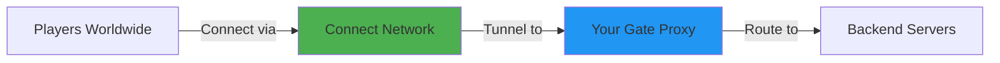
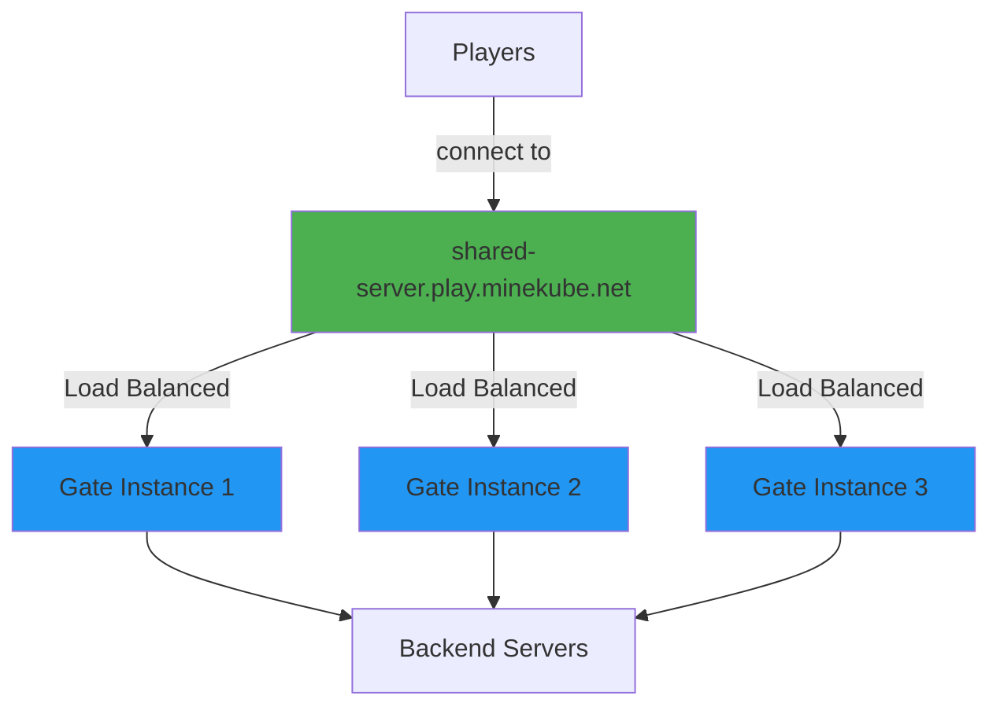

# Gate Connect Integration

Gate Connect is a powerful network service that makes your Minecraft proxy universally accessible to players worldwide without requiring port forwarding or a public IP address. It's an ideal solution for:

- **Home servers** without public IP addresses
- **Development environments** for testing
- **Load-balanced deployments** across multiple Gate instances
- **Dynamic infrastructure** where IPs frequently change

## How Gate Connect Works

Gate Connect acts as a bridge between your locally hosted proxy and the global Minecraft community:



When enabled, Gate registers itself with the Connect network and receives a free domain: `<your-endpoint-name>.play.minekube.net`. Players can then connect from anywhere without you needing to configure port forwarding.

## Quick Setup

### Step 1: Enable Connect

Add the Connect configuration to your `config.yml`:

```yaml config.yml
connect:
  # Enable Connect integration
  enabled: true
  
  # Your globally unique endpoint name
  # This becomes: my-awesome-server.play.minekube.net
  name: my-awesome-server
```

### Step 2: Configure Authentication

You have two options for obtaining a Connect token:

#### Option A: Auto-Generate Token (Easiest)

Simply start Gate with the endpoint name configured. If the name isn't taken, a token will be auto-generated:

```bash
gate
```

Gate will automatically create a `connect.json` file with your token.

#### Option B: Use Connect Dashboard

1. Visit the [Connect Dashboard](https://app.minekube.com)
2. Create a new endpoint with your chosen name
3. Copy the generated token
4. Create a `connect.json` file:

```json connect.json
{
  "token": "YOUR-TOKEN-HERE"
}
```

Alternatively, set the token via environment variable:

```bash
export CONNECT_TOKEN="YOUR-TOKEN-HERE"
gate
```

### Step 3: Verify Connection

Once Gate starts, you should see log messages confirming Connect registration:

```
[Connect] Registered endpoint: my-awesome-server
[Connect] Public address: my-awesome-server.play.minekube.net
```

Players can now connect using `my-awesome-server.play.minekube.net`!

## Advanced Configuration

### Offline Mode Support

Gate Connect supports offline mode (cracked) players, allowing non-premium Minecraft accounts to join:

```yaml config.yml
connect:
  enabled: true
  name: my-server
  # Allow offline mode players through Connect
  allowOfflineModePlayers: true
```

**Important Configuration Notes:**

<CodeGroup>
```yaml Gate config.yml
config:
  # Gate can keep online mode enabled
  onlineMode: true
  # Force key authentication (optional)
  forceKeyAuthentication: true
```

```properties server.properties
# Backend servers MUST have these settings
online-mode=false
enforce-secure-profile=false
```
</CodeGroup>

<Info>
**Authentication Flow:** When `allowOfflineModePlayers: true` is set, Connect handles connection injection in offline mode while Gate's `onlineMode: true` still authenticates premium players joining directly. This provides the best of both worlds.
</Info>

### Load Balancing with Connect

One of Connect's most powerful features is built-in load balancing across multiple Gate instances. Multiple Gate proxies can share the same endpoint name:

```yaml
# Same endpoint name across all Gate instances
connect:
  enabled: true
  name: shared-endpoint-name  # Same name on all instances!
```

**Setup Steps:**

1. Configure first Gate instance with Connect enabled
2. Copy the generated `connect.json` token file from the first instance
3. Deploy additional Gate instances with:
   - Same `connect.name` in configuration
   - Same `connect.json` token file

**Architecture Example:**



**Benefits:**
- Automatic distribution of player connections
- Zero-downtime deployments (rolling updates)
- Horizontal scaling based on player load
- Built-in redundancy and failover

## High-Availability Deployment

Combine Connect with Kubernetes for a production-grade, highly available setup:

```yaml deployment.yaml
apiVersion: apps/v1
kind: Deployment
metadata:
  name: gate-proxy
spec:
  replicas: 3  # Multiple Gate instances
  selector:
    matchLabels:
      app: gate
  template:
    metadata:
      labels:
        app: gate
    spec:
      containers:
      - name: gate
        image: ghcr.io/minekube/gate:latest
        env:
        - name: CONNECT_TOKEN
          valueFrom:
            secretKeyRef:
              name: gate-connect
              key: token
        volumeMounts:
        - name: config
          mountPath: /app/config.yml
          subPath: config.yml
      volumes:
      - name: config
        configMap:
          name: gate-config
---
apiVersion: v1
kind: Secret
metadata:
  name: gate-connect
type: Opaque
stringData:
  token: YOUR-CONNECT-TOKEN
```

**Key Features:**
- **replicas: 3** - Run three Gate instances for redundancy
- **Connect token** - Stored securely in Kubernetes Secret
- **Shared endpoint** - All instances use same Connect endpoint name
- **Auto-recovery** - Kubernetes restarts failed instances automatically

## Troubleshooting

### Authentication Errors

**Symptom:** "Invalid signature for profile public key"

**Solutions:**

<Steps>
  <Step title="Verify Backend Configuration">
    Ensure backend servers have:
    ```properties
    online-mode=false
    enforce-secure-profile=false
    ```
  </Step>
  
  <Step title="Force Endpoint Refresh">
    Change your endpoint name temporarily to clear Connect's cache:
    ```yaml
    connect:
      name: my-server-temp  # Different name
    ```
    Restart Gate, then change back to original name.
  </Step>
  
  <Step title="Validate Configuration">
    Confirm `allowOfflineModePlayers: true` is set if using offline mode.
  </Step>
</Steps>

### Chat Disabled Error

**Symptom:** "Chat disabled due to missing profile public key"

**Solution:** Set `enforce-secure-profile=false` in backend server's `server.properties`

### Configuration Changes Not Applied

**Symptoms:** Offline players still can't join after enabling `allowOfflineModePlayers`

**Solutions:**

1. **Wait 2-3 minutes** - Connect network needs time to propagate changes
2. **Restart Gate** - Force re-registration with new settings
3. **Change endpoint name** - Force fresh registration if caching persists

### Connection Issues

<AccordionGroup>
  <Accordion title="Players can't connect to .play.minekube.net domain">
    **Check:**
    - Gate logs show successful Connect registration
    - Endpoint name is valid (alphanumeric, hyphens only)
    - Token is correct in `connect.json` or `CONNECT_TOKEN` env var
    - Firewall allows Gate to make outbound connections
  </Accordion>
  
  <Accordion title="Load balancing not working across instances">
    **Verify:**
    - All instances use **identical** endpoint name
    - All instances share **same** `connect.json` token file
    - All instances successfully registered (check logs)
    - Instances are actually running and accepting connections
  </Accordion>
  
  <Accordion title="Endpoint name already in use">
    **Solutions:**
    - Choose a different, unique endpoint name
    - If you own the endpoint, use the token from Connect Dashboard
    - Contact support if you believe the name is wrongly taken
  </Accordion>
</AccordionGroup>

## Monitoring and Metrics

Monitor Connect status through Gate's logging:

```bash
# Successful registration
[Connect] Registered endpoint: my-server
[Connect] Public address: my-server.play.minekube.net

# Connection events
[Connect] Session connected
[Connect] Session watcher disconnected by server, reconnecting
```

**Health Checks:**

Gate automatically maintains the Connect tunnel and reconnects if disconnected. Watch for:
- Frequent reconnection messages (may indicate network issues)
- Registration failures (check token validity)
- Endpoint conflicts (name already in use)

## Best Practices

<CardGroup cols={2}>
  <Card title="Use Descriptive Names" icon="tag">
    Choose memorable endpoint names that represent your server brand:
    - `awesome-survival.play.minekube.net` ✅
    - `server1.play.minekube.net` ❌
  </Card>
  
  <Card title="Secure Your Token" icon="lock">
    Treat Connect tokens like passwords:
    - Store in environment variables or secrets managers
    - Don't commit `connect.json` to version control
    - Rotate tokens if exposed
  </Card>
  
  <Card title="Test Offline Mode" icon="flask">
    Before production, verify offline mode configuration:
    - Test with both premium and cracked accounts
    - Confirm chat and gameplay work correctly
    - Check authentication flow logs
  </Card>
  
  <Card title="Monitor Connections" icon="chart-line">
    Track Connect health and player distribution:
    - Enable debug logging during initial setup
    - Monitor reconnection frequency
    - Track which Gate instances receive connections
  </Card>
</CardGroup>

## Migration from Direct Connections

Transitioning from traditional port forwarding to Connect:

<Steps>
  <Step title="Enable Connect Alongside Direct Access">
    Keep your existing port forwarding active while testing Connect.
  </Step>
  
  <Step title="Test with Beta Players">
    Share the `.play.minekube.net` domain with trusted players for testing.
  </Step>
  
  <Step title="Update Server Listings">
    Update your server's advertised address on server lists and social media.
  </Step>
  
  <Step title="Remove Port Forwarding (Optional)">
    Once Connect is stable, you can remove port forwarding rules.
  </Step>
</Steps>

## Getting Help

If you encounter issues not covered in this guide:

- **Check logs** - Both Gate and backend server logs contain valuable debugging info
- **Community support** - Join the [Gate Discord](https://minekube.com/discord) for real-time help
- **GitHub issues** - Report bugs with logs and reproduction steps on [Gate repository](https://github.com/minekube/gate/issues)
- **Connect docs** - Visit [Connect documentation](https://connect.minekube.com) for network-specific information

## Related Resources

<CardGroup cols={2}>
  <Card title="Load Balancing" href="./load-balancing">
    Learn about load balancing strategies across Gate instances
  </Card>
  
  <Card title="Failover Configuration" href="./failover">
    Configure failover mechanisms for high availability
  </Card>
  
  <Card title="Connect Network" href="https://connect.minekube.com" icon="link">
    Official Connect network documentation
  </Card>
  
  <Card title="Kubernetes Deployment" href="/deployment/kubernetes">
    Deploy Gate on Kubernetes for production
  </Card>
</CardGroup>