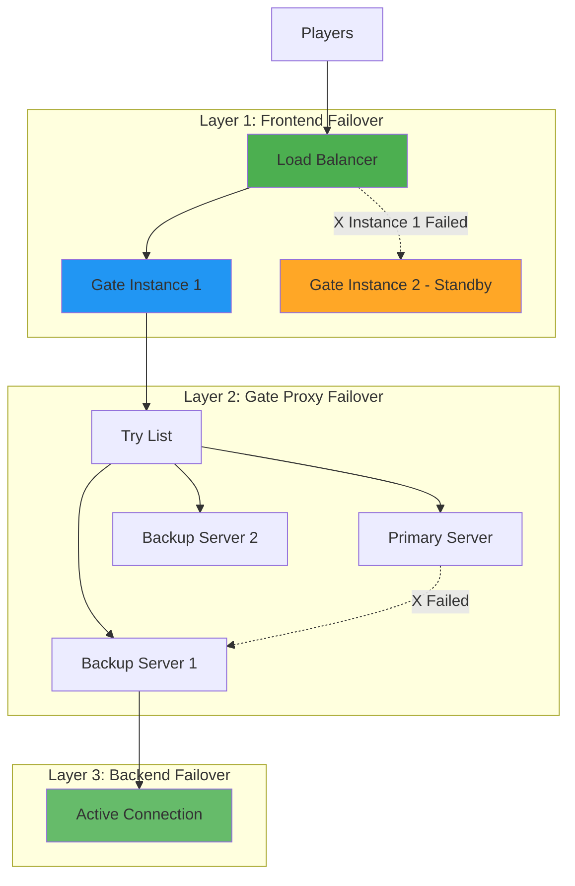
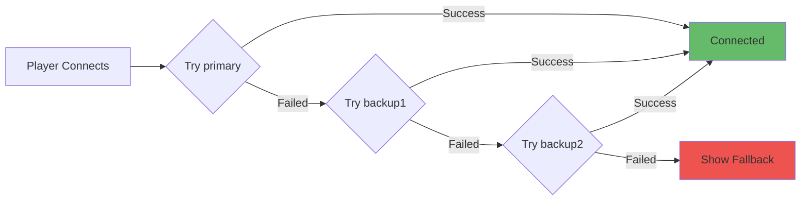

# Failover and High Availability

Gate provides comprehensive failover mechanisms at multiple levels to ensure your Minecraft network remains available even during infrastructure failures, maintenance, or unexpected issues.

## Failover Architecture

Gate implements failover at three distinct layers:



## Layer 1: Frontend Gate Instance Failover

Ensure continuous proxy availability when individual Gate instances fail.

### Method 1: Multiple Gate Instances with Connect

The simplest approach uses Gate Connect's built-in redundancy:

```yaml config.yml (All instances)
connect:
  enabled: true
  name: production-server  # Same endpoint name
```

**Setup:**

<Steps>
  <Step title="Deploy First Gate Instance">
    Configure and start the first Gate instance with Connect enabled.
  </Step>
  
  <Step title="Copy Connect Token">
    Copy the generated `connect.json` file to your other instances.
  </Step>
  
  <Step title="Deploy Additional Instances">
    Start additional Gate instances with the same endpoint name and token.
  </Step>
  
  <Step title="Verify Registration">
    Check logs to confirm all instances successfully registered:
    ```
    [Connect] Registered endpoint: production-server
    ```
  </Step>
</Steps>

**Failover Behavior:**
- Automatic health checking by Connect network
- Failed instances removed from rotation instantly  
- No player-facing downtime
- Automatic recovery when instance comes back online

**Benefits:**
- Zero configuration failover
- No external load balancer required
- Works anywhere (home servers, cloud, containers)
- Built-in health monitoring

### Method 2: Kubernetes with Replica Sets

For cloud-native deployments, leverage Kubernetes' self-healing:

```yaml gate-deployment.yaml
apiVersion: apps/v1
kind: Deployment
metadata:
  name: gate-proxy
  namespace: minecraft
spec:
  replicas: 3  # Run 3 instances for redundancy
  strategy:
    type: RollingUpdate
    rollingUpdate:
      maxUnavailable: 1  # Keep at least 2 instances running during updates
      maxSurge: 1        # Allow 1 extra instance during rollout
  selector:
    matchLabels:
      app: gate
  template:
    metadata:
      labels:
        app: gate
    spec:
      containers:
      - name: gate
        image: ghcr.io/minekube/gate:latest
        ports:
        - containerPort: 25565
          protocol: TCP
        livenessProbe:
          tcpSocket:
            port: 25565
          initialDelaySeconds: 30
          periodSeconds: 10
          timeoutSeconds: 5
          failureThreshold: 3
        readinessProbe:
          tcpSocket:
            port: 25565
          initialDelaySeconds: 5
          periodSeconds: 5
          timeoutSeconds: 3
          failureThreshold: 2
        resources:
          requests:
            memory: "512Mi"
            cpu: "500m"
          limits:
            memory: "2Gi"
            cpu: "2000m"
---
apiVersion: v1
kind: Service
metadata:
  name: gate-service
  namespace: minecraft
spec:
  type: LoadBalancer
  sessionAffinity: ClientIP
  sessionAffinityConfig:
    clientIP:
      timeoutSeconds: 10800  # 3 hours
  selector:
    app: gate
  ports:
  - protocol: TCP
    port: 25565
    targetPort: 25565
```

**Key Features:**

<CardGroup cols={2}>
  <Card title="Replica Sets" icon="copy">
    `replicas: 3` ensures three instances always running. Kubernetes automatically recreates failed pods.
  </Card>
  
  <Card title="Health Probes" icon="heartbeat">
    Liveness and readiness probes detect unhealthy instances and remove them from service.
  </Card>
  
  <Card title="Rolling Updates" icon="rotate">
    Zero-downtime deployments with `maxUnavailable: 1` ensuring continuous availability.
  </Card>
  
  <Card title="Session Affinity" icon="link">
    `sessionAffinity: ClientIP` keeps players connected to the same instance across reconnects.
  </Card>
</CardGroup>

**Failover Timeline:**

```
t=0s    Instance 1 crashes
t=10s   Liveness probe fails after 3 attempts (10s * 1 check)
t=11s   Kubernetes marks pod as unhealthy
t=12s   Service removes pod from load balancer rotation
t=13s   Kubernetes starts replacement pod
t=43s   New pod passes readiness probe (30s initial + checks)
t=44s   New pod added to service rotation

Total player-facing disruption: ~2s (existing connections to Instance 1)
New connections: Routed to healthy instances immediately
```

### Method 3: HAProxy with Health Checks

For traditional infrastructure, configure HAProxy for automatic failover:

```haproxy haproxy.cfg
global
    log stdout local0
    maxconn 10000
    daemon

defaults
    log global
    mode tcp
    option tcplog
    timeout connect 5s
    timeout client 1h
    timeout server 1h
    timeout check 5s

frontend minecraft
    bind *:25565
    default_backend gate_proxies

backend gate_proxies
    balance leastconn
    option tcp-check
    
    # Sticky sessions based on source IP
    stick-table type ip size 100k expire 3h
    stick on src
    
    # Health check configuration
    default-server inter 2s fall 3 rise 2 on-marked-down shutdown-sessions
    
    server gate1 10.0.1.10:25565 check
    server gate2 10.0.1.11:25565 check
    server gate3 10.0.1.12:25565 check backup  # Only used when gate1 & gate2 fail
```

**Health Check Parameters:**
- `inter 2s` - Check every 2 seconds
- `fall 3` - Mark down after 3 failed checks (6 seconds)
- `rise 2` - Mark up after 2 successful checks (4 seconds)
- `on-marked-down shutdown-sessions` - Gracefully close connections when backend fails

**Failover Behavior:**
```
Normal:  gate1 (UP) + gate2 (UP) + gate3 (backup)
gate1 fails after 6s → gate2 (UP) + gate3 (UP - activated)
gate1 recovers after 4s → gate1 (UP) + gate2 (UP) + gate3 (backup - deactivated)
```

## Layer 2: Backend Server Failover

Gate automatically handles backend server failures and reconnects players to available servers.

### Try List Configuration

The `try` list defines the server order Gate attempts when connecting players:

```yaml config.yml
config:
  servers:
    lobby-primary: 10.0.1.20:25565
    lobby-backup: 10.0.1.21:25565
    survival: 10.0.1.30:25565
    creative: 10.0.1.40:25565
  
  try:
    - lobby-primary   # Try first
    - lobby-backup    # Fallback if primary fails
    - survival        # Fallback if both lobbies fail
```

**Behavior on Login:**

<Steps>
  <Step title="Player Joins">
    Gate receives player connection.
  </Step>
  
  <Step title="Try Primary Server">
    Gate attempts connection to `lobby-primary`.
  </Step>
  
  <Step title="Failover on Failure">
    If `lobby-primary` is offline, Gate automatically tries `lobby-backup`.
  </Step>
  
  <Step title="Continue Down List">
    If `lobby-backup` also fails, Gate tries `survival`, then `creative`.
  </Step>
  
  <Step title="Final Failure">
    If all servers fail, player is disconnected with a message.
  </Step>
</Steps>

### Automatic Reconnection on Disconnect

Gate can automatically reconnect players when they're kicked from a server:

```yaml config.yml
config:
  # Enable automatic failover when server disconnects unexpectedly
  failoverOnUnexpectedServerDisconnect: true
  
  try:
    - lobby
    - survival
    - creative
```

**Failover Triggers:**

✅ **Triggers Failover:**
- Server crashes (connection lost)
- Server becomes unreachable (network failure)
- Server sends disconnect without reason
- Server times out

❌ **Does NOT Trigger Failover:**
- Server kicks player with explicit reason ("You are banned")
- Player uses `/server` command
- Server shutdown with proper kick message

**Example Scenario:**
```
1. Player is on "survival" server
2. Survival server crashes (no response)
3. Gate detects disconnect
4. Gate automatically connects player to "lobby" (first in try list)
5. Player sees: "The server you were on went down. Connecting to lobby..."
```

<Warning>
**Important:** Set `failoverOnUnexpectedServerDisconnect: true` carefully. If a server legitimately kicks players (e.g., for rule violations), failover will circumvent the kick by reconnecting them to another server.
</Warning>

### Lite Mode Backend Failover

In Lite mode, Gate tries backends in order automatically:

```yaml config.yml
config:
  lite:
    enabled: true
    routes:
      - host: "play.example.com"
        backend:
          - "primary:25565"   # Try first
          - "backup1:25565"   # Try if primary fails
          - "backup2:25565"   # Try if backup1 fails
        strategy: sequential  # Explicit sequential failover
        fallback:
          motd: |
            §cAll servers are offline
            §ePlease try again later
          version:
            name: '§cMaintenance'
            protocol: -1
```

**Failover Flow:**



**Benefits:**
- Automatic backend health checking
- Instant failover on connection failure
- Custom fallback messages when all backends down
- Works for both player connections and status pings

## Layer 3: Connection-Level Failover

Gate handles individual connection failures gracefully.

### Connection Timeouts

Configure aggressive timeouts for fast failure detection:

```yaml config.yml
config:
  # Time to wait for backend connection before failing over
  connectionTimeout: 3s
  
  # Time to wait for backend response before failing over
  readTimeout: 30s
```

**Recommendations:**

| Scenario | connectionTimeout | readTimeout |
|----------|-------------------|-------------|
| Fast failover (vanilla) | 2-3s | 15-30s |
| Modded servers (Forge/Fabric) | 5-10s | 60-90s |
| High-latency networks | 5-10s | 45-60s |

**Behavior:**
```
Player connects → Gate tries backend
  ↓ (within connectionTimeout)
  ├─ Success → Connection established
  └─ Timeout → Try next backend in list
```

### Rate Limiting and Protection

Protect against connection floods that could prevent legitimate failover:

```yaml config.yml
config:
  quota:
    connections:
      enabled: true
      ops: 5          # Allow 5 new connections per second
      burst: 10       # Allow burst of up to 10 connections
      maxEntries: 1000
    logins:
      enabled: true
      ops: 0.4        # Allow 1 login every 2.5 seconds
      burst: 3        # Allow burst of 3 logins
      maxEntries: 1000
```

**Benefits:**
- Prevents connection exhaustion during failures
- Ensures resources available for failover operations
- Protects against DoS attacks during incidents

## High-Availability Deployment Patterns

### Pattern 1: Active-Active (Recommended)

Multiple Gate instances actively serving traffic:

```yaml
Architecture:
  Frontend:
    - Load Balancer (HAProxy/K8s Service/Connect)
  Gate Instances:
    - gate-1: Active (serving 33% traffic)
    - gate-2: Active (serving 33% traffic) 
    - gate-3: Active (serving 33% traffic)
  Backend Servers:
    - lobby: 10.0.1.20:25565
    - survival: 10.0.1.30:25565
```

**Characteristics:**
- All instances actively handling connections
- Load distributed evenly
- Maximum resource utilization
- Survives n-1 failures (can lose any single instance)

**Benefits:**
- No idle resources
- Better performance under normal load
- Graceful degradation (performance decreases gradually)

### Pattern 2: Active-Passive (Cost-Optimized)

Primary instance serves traffic, backup stands ready:

```yaml
Architecture:
  Frontend:
    - Load Balancer (HAProxy with backup servers)
  Gate Instances:
    - gate-primary: Active (serving 100% traffic)
    - gate-backup: Passive (standby, only on failure)
  Backend Servers:
    - lobby: 10.0.1.20:25565
```

**HAProxy Configuration:**
```haproxy
backend gate_proxies
    server gate-primary 10.0.1.10:25565 check
    server gate-backup 10.0.1.11:25565 check backup
```

**Characteristics:**
- Backup only receives traffic when primary fails
- Lower resource costs (backup can be smaller)
- Slower failover (backup needs to handle full load suddenly)

**Use Cases:**
- Cost-sensitive deployments
- Predictable traffic patterns
- Development/staging environments

### Pattern 3: Multi-Region (Geo-Distributed)

Gate instances across multiple geographic regions:

```yaml
Architecture:
  Region: US-East
    - gate-us-1, gate-us-2
    - Backend servers in US
  
  Region: EU-West  
    - gate-eu-1, gate-eu-2
    - Backend servers in EU
  
  Region: Asia-Pacific
    - gate-ap-1, gate-ap-2
    - Backend servers in Asia
```

**Lite Mode Configuration:**
```yaml config.yml
config:
  lite:
    enabled: true
    routes:
      - host: "*.global.example.com"
        backend:
          - "us-east-cluster:25565"
          - "eu-west-cluster:25565"
          - "asia-pac-cluster:25565"
        strategy: lowest-latency  # Route to nearest region
```

**Benefits:**
- Survives entire region failures
- Lower latency for global players
- Compliance with data residency requirements

**Challenges:**
- More complex configuration
- Higher operational costs
- Cross-region data synchronization

## Disaster Recovery

### Backup and Restore Procedures

<Steps>
  <Step title="Backup Gate Configuration">
    ```bash
    # Backup configuration files
    tar -czf gate-backup-$(date +%Y%m%d).tar.gz \
      config.yml \
      connect.json \
      plugins/ \
      logs/
    ```
  </Step>
  
  <Step title="Store Backups Securely">
    ```bash
    # Upload to cloud storage (example with S3)
    aws s3 cp gate-backup-*.tar.gz s3://my-backups/gate/
    ```
  </Step>
  
  <Step title="Test Restore Procedure">
    Regularly test restoration in a staging environment:
    ```bash
    # Download latest backup
    aws s3 cp s3://my-backups/gate/gate-backup-latest.tar.gz .
    
    # Extract and verify
    tar -xzf gate-backup-latest.tar.gz
    ./gate --config config.yml
    ```
  </Step>
  
  <Step title="Automate with Cron">
    ```bash
    # Add to crontab for daily backups
    0 2 * * * /opt/gate/backup.sh
    ```
  </Step>
</Steps>

### Recovery Time Objectives (RTO)

Set and measure recovery objectives:

| Scenario | Target RTO | Achieved Through |
|----------|------------|------------------|
| Single Gate instance failure | < 30s | Active-active with health checks |
| Backend server failure | < 5s | Try list + failoverOnUnexpectedServerDisconnect |
| Entire datacenter failure | < 5min | Multi-region with DNS failover |
| Configuration corruption | < 30min | Automated backups + restore procedure |

## Monitoring and Alerting

### Critical Metrics to Monitor

<CardGroup cols={2}>
  <Card title="Gate Instance Health" icon="heartbeat">
    - Process uptime
    - Memory usage
    - CPU utilization
    - Connection count
  </Card>
  
  <Card title="Backend Server Status" icon="server">
    - Reachability (ping/status)
    - Response time
    - Player count
    - Failed connection attempts
  </Card>
  
  <Card title="Failover Events" icon="rotate">
    - Failover frequency
    - Recovery time
    - Affected players
    - Root cause (if known)
  </Card>
  
  <Card title="Player Experience" icon="user">
    - Login success rate
    - Connection errors
    - Unexpected disconnects
    - Average connection time
  </Card>
</CardGroup>

### Example Monitoring with Prometheus

If Gate exposes metrics (via HTTP API or custom exporter):

```yaml prometheus-alerts.yml
groups:
  - name: gate-alerts
    rules:
      # Alert when Gate instance is down
      - alert: GateInstanceDown
        expr: up{job="gate"} == 0
        for: 1m
        labels:
          severity: critical
        annotations:
          summary: "Gate instance {{ $labels.instance }} is down"
      
      # Alert when all Gate instances are down
      - alert: AllGateInstancesDown
        expr: count(up{job="gate"} == 1) == 0
        for: 30s
        labels:
          severity: critical
        annotations:
          summary: "All Gate instances are down - players cannot connect"
      
      # Alert when backend server unreachable
      - alert: BackendServerUnreachable
        expr: gate_backend_status{status="offline"} == 1
        for: 2m
        labels:
          severity: warning
        annotations:
          summary: "Backend server {{ $labels.server }} is unreachable"
```

### Log-Based Monitoring

Monitor Gate logs for failover events:

```bash
# Watch for backend connection failures
tail -f logs/latest.log | grep -i "failed to connect"

# Count failover events in last hour
grep "trying next backend" logs/latest.log | grep "$(date -d '1 hour ago' '+%H:')" | wc -l

# Alert on repeated failures
tail -f logs/latest.log | awk '/failed to connect/ { count++; if (count > 5) print "ALERT: Multiple backend failures" }'
```

## Testing Failover

Regularly test failover mechanisms to ensure they work when needed:

### Test 1: Backend Server Failover

<Steps>
  <Step title="Simulate Backend Failure">
    ```bash
    # Stop primary backend server
    systemctl stop minecraft-lobby-primary
    ```
  </Step>
  
  <Step title="Verify Failover">
    - Attempt player connection
    - Confirm connection to backup server
    - Check Gate logs for failover messages
  </Step>
  
  <Step title="Restore Primary">
    ```bash
    # Restart primary server
    systemctl start minecraft-lobby-primary
    ```
  </Step>
  
  <Step title="Verify Recovery">
    - Confirm primary server in rotation
    - New connections use primary
  </Step>
</Steps>

### Test 2: Gate Instance Failover

<Steps>
  <Step title="Simulate Gate Failure">
    ```bash
    # If using Kubernetes
    kubectl delete pod gate-proxy-xyz123
    
    # If using systemd
    systemctl stop gate
    ```
  </Step>
  
  <Step title="Verify Load Balancer Failover">
    - Monitor load balancer logs
    - Confirm traffic routed to healthy instances
    - Test new player connections
  </Step>
  
  <Step title="Measure Recovery Time">
    - Time from failure to instance replacement
    - Time from failure to full traffic recovery
  </Step>
</Steps>

### Test 3: Chaos Engineering

Use chaos engineering tools for comprehensive testing:

```bash
# Random pod deletion (Kubernetes)
kubectl delete pod -n minecraft -l app=gate --random

# Network partition simulation
toxiproxy-cli toxic add -n latency -t latency -a latency=1000 gate-backend

# Resource exhaustion
stress-ng --vm 2 --vm-bytes 1G --timeout 60s
```

## Best Practices

<CardGroup cols={2}>
  <Card title="Defense in Depth" icon="shield">
    Implement failover at multiple layers (frontend, Gate, backend) for maximum resilience.
  </Card>
  
  <Card title="Test Regularly" icon="flask">
    Schedule monthly failover drills to verify mechanisms work correctly.
  </Card>
  
  <Card title="Monitor Continuously" icon="chart-line">
    Set up alerts for failures and track failover events over time.
  </Card>
  
  <Card title="Document Procedures" icon="book">
    Maintain runbooks for common failure scenarios and recovery procedures.
  </Card>
  
  <Card title="Automate Recovery" icon="robot">
    Use orchestration tools (Kubernetes, Systemd) for automatic instance recovery.
  </Card>
  
  <Card title="Optimize Timeouts" icon="clock">
    Balance fast failover with avoiding false positives from temporary issues.
  </Card>
</CardGroup>

## Troubleshooting

<AccordionGroup>
  <Accordion title="Players disconnected during failover">
    **Expected Behavior:** Players connected to failed instance will disconnect.
    
    **Mitigation:**
    - Use `failoverOnUnexpectedServerDisconnect: true` for automatic backend failover
    - Implement session affinity on frontend load balancer
    - Use multiple Gate instances to minimize impact radius
  </Accordion>
  
  <Accordion title="Failover loops (continuous switching)">
    **Possible Causes:**
    - All backends unhealthy but health checks inconsistent
    - Timeout values too aggressive
    - Network issues causing intermittent failures
    
    **Solutions:**
    - Increase `connectionTimeout` and health check intervals
    - Implement exponential backoff for failed backends
    - Fix underlying network/server issues
  </Accordion>
  
  <Accordion title="Backup server never receives traffic">
    **Check:**
    - Backup server configured correctly in try list or as HAProxy backup
    - Primary server is actually failing (not just slow)
    - Health checks detecting primary failure properly
    
    **Debug:**
    ```bash
    # Force primary offline to test backup
    # Verify backup receives connections
    ```
  </Accordion>
  
  <Accordion title="Slow failover (> 30 seconds)">
    **Possible Causes:**
    - Long timeout values
    - Slow health check intervals  
    - Resource exhaustion (CPU/memory)
    
    **Solutions:**
    - Reduce `connectionTimeout` to 2-5 seconds
    - Increase health check frequency
    - Scale up instance resources
  </Accordion>
</AccordionGroup>

## Related Resources

<CardGroup cols={2}>
  <Card title="Load Balancing" href="./load-balancing">
    Configure load balancing strategies for optimal distribution
  </Card>
  
  <Card title="Gate Connect" href="./connect">
    Use Connect for automatic failover and load balancing
  </Card>
  
  <Card title="Kubernetes Deployment" href="/deployment/kubernetes">
    Deploy Gate on Kubernetes with built-in self-healing
  </Card>
  
  <Card title="Configuration Reference" href="/configuration/reference">
    Complete configuration options documentation
  </Card>
</CardGroup>