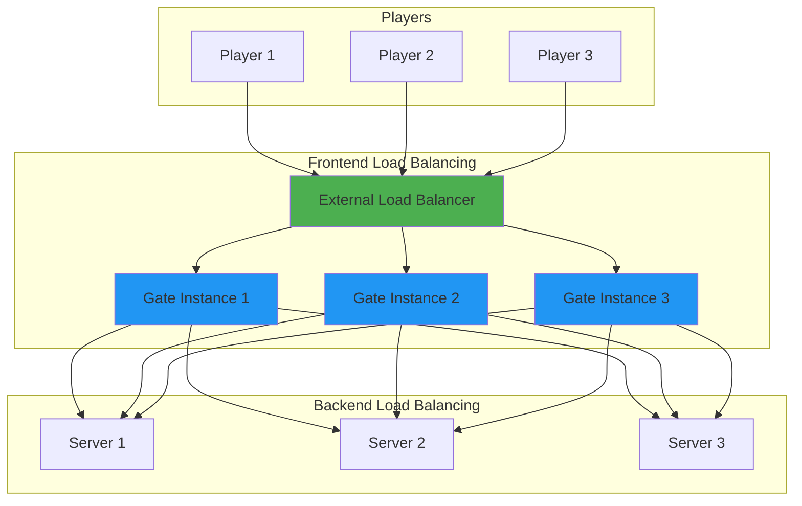

# Load Balancing with Gate

Gate provides sophisticated load balancing capabilities at two distinct levels:

1. **Frontend Load Balancing** - Distributing player connections across multiple Gate proxy instances
2. **Backend Load Balancing** - Distributing connections from Gate to backend Minecraft servers

This dual-layer approach enables highly scalable and resilient Minecraft network architectures.

## Architecture Overview



## Frontend Load Balancing

Distribute incoming player connections across multiple Gate instances for horizontal scaling and high availability.

### Method 1: Gate Connect (Recommended)

The simplest approach uses Gate Connect's built-in load balancing:

```yaml config.yml (All instances)
connect:
  enabled: true
  name: shared-endpoint-name  # Same on all instances
```

**Setup:**

1. Configure first Gate instance with Connect
2. Copy the `connect.json` token file
3. Deploy additional instances with the same endpoint name and token

**Benefits:**
- Zero configuration load balancing
- Automatic health checks
- Built-in failover
- No additional infrastructure required

**Use Cases:**
- Home servers without static IPs
- Development and testing environments
- Quick production deployments
- Dynamic infrastructure (cloud, containers)

### Method 2: Kubernetes Service

For cloud-native deployments, use Kubernetes native load balancing:

```yaml gate-deployment.yaml
apiVersion: v1
kind: Service
metadata:
  name: gate-proxy
spec:
  type: LoadBalancer
  selector:
    app: gate
  ports:
  - protocol: TCP
    port: 25565
    targetPort: 25565
  sessionAffinity: ClientIP  # Sticky sessions for player consistency
  sessionAffinityConfig:
    clientIP:
      timeoutSeconds: 10800  # 3 hours
---
apiVersion: apps/v1
kind: Deployment
metadata:
  name: gate-proxy
spec:
  replicas: 3
  selector:
    matchLabels:
      app: gate
  template:
    metadata:
      labels:
        app: gate
    spec:
      containers:
      - name: gate
        image: ghcr.io/minekube/gate:latest
        ports:
        - containerPort: 25565
        resources:
          requests:
            memory: "512Mi"
            cpu: "500m"
          limits:
            memory: "2Gi"
            cpu: "2000m"
```

**Key Configuration:**
- `sessionAffinity: ClientIP` - Ensures players reconnect to same instance
- `replicas: 3` - Run three Gate instances
- Resource limits prevent resource starvation

**Benefits:**
- Native cloud integration
- Health check automation
- Auto-scaling capabilities
- Enterprise-grade reliability

### Method 3: TCP Load Balancer (HAProxy/nginx)

For traditional infrastructure, use dedicated TCP load balancers:

<Tabs>
  <Tab title="HAProxy">
    ```haproxy haproxy.cfg
    global
        log stdout local0
        maxconn 4096

    defaults
        log global
        mode tcp
        option tcplog
        timeout connect 5s
        timeout client 1h
        timeout server 1h

    frontend minecraft
        bind *:25565
        default_backend gate_proxies

    backend gate_proxies
        balance leastconn
        option tcp-check
        
        # Sticky sessions based on source IP
        stick-table type ip size 100k expire 3h
        stick on src
        
        server gate1 10.0.1.10:25565 check inter 2s fall 3 rise 2
        server gate2 10.0.1.11:25565 check inter 2s fall 3 rise 2
        server gate3 10.0.1.12:25565 check inter 2s fall 3 rise 2
    ```
  </Tab>
  
  <Tab title="nginx">
    ```nginx nginx.conf
    stream {
        upstream gate_proxies {
            least_conn;
            
            server 10.0.1.10:25565 max_fails=3 fail_timeout=30s;
            server 10.0.1.11:25565 max_fails=3 fail_timeout=30s;
            server 10.0.1.12:25565 max_fails=3 fail_timeout=30s;
        }

        server {
            listen 25565;
            proxy_pass gate_proxies;
            proxy_timeout 1h;
            proxy_connect_timeout 5s;
        }
    }
    ```
  </Tab>
</Tabs>

**Configuration Highlights:**
- `leastconn` - Routes to instance with fewest connections
- `stick-table` - Session persistence based on IP
- Health checks with automatic failover
- Configurable timeouts for long-lived connections

## Backend Load Balancing

Gate Lite mode provides powerful load balancing strategies for distributing connections to backend servers.

### Enabling Lite Mode

Lite mode transforms Gate into a lightweight reverse proxy with advanced routing:

```yaml config.yml
config:
  lite:
    enabled: true
    routes:
      - host: "play.example.com"
        backend: ["server1:25565", "server2:25565", "server3:25565"]
        strategy: round-robin  # Choose your strategy
```

### Load Balancing Strategies

Gate Lite supports five load balancing strategies, each optimized for different scenarios:

#### 1. Sequential (Default)

**Behavior:** Always tries the first backend, falling back to subsequent servers only on failure.

```yaml
routes:
  - host: "play.example.com"
    backend: ["primary:25565", "backup1:25565", "backup2:25565"]
    strategy: sequential  # or omit strategy field
```

**Use Cases:**
- Primary/backup server configurations
- Failover without load distribution
- Cost optimization (keep backup servers idle)

**Behavior:**
```
Connection 1 → primary:25565
Connection 2 → primary:25565
Connection 3 → primary:25565
(Only uses backup if primary fails)
```

#### 2. Random

**Behavior:** Randomly selects a backend for each new connection.

```yaml
routes:
  - host: "lobby.example.com"
    backend: ["lobby1:25565", "lobby2:25565", "lobby3:25565"]
    strategy: random
```

**Use Cases:**
- Simple load distribution
- Stateless server pools
- Equal-capacity servers

**Characteristics:**
- Very fast selection (no state tracking)
- Good distribution over many connections
- No session affinity

#### 3. Round-Robin

**Behavior:** Cycles through backends in order, distributing connections evenly.

```yaml
routes:
  - host: "survival.example.com"
    backend: ["survival1:25565", "survival2:25565", "survival3:25565"]
    strategy: round-robin
```

**Use Cases:**
- Evenly matched server capacity
- Predictable load distribution
- Multiple identical server instances

**Behavior:**
```
Connection 1 → survival1:25565
Connection 2 → survival2:25565
Connection 3 → survival3:25565
Connection 4 → survival1:25565 (cycles back)
```

**State Management:**
- Per-route counter tracks current position
- Independent round-robin state for each route
- Wraps around when reaching the end

#### 4. Least-Connections

**Behavior:** Routes to the backend with the fewest active connections.

```yaml
routes:
  - host: "minigames.example.com"
    backend: ["game1:25565", "game2:25565", "game3:25565"]
    strategy: least-connections
```

**Use Cases:**
- Variable connection durations
- Mixed server capacities
- Optimal resource utilization

**How It Works:**
- Tracks active connections per backend
- Increments counter when connection established
- Decrements when connection closes
- Selects backend with minimum count

**Example Scenario:**
```
Backend          Active Connections    Next Connection Goes To
server1:25565    15                    
server2:25565    8                     ← Selected (least)
server3:25565    12
```

#### 5. Lowest-Latency

**Behavior:** Routes to the backend with the fastest response time.

```yaml
routes:
  - host: "global.example.com"
    backend: ["us-east:25565", "eu-west:25565", "asia-pac:25565"]
    strategy: lowest-latency
```

**Use Cases:**
- Geographically distributed backends
- Performance-critical routing
- Heterogeneous server hardware

**How It Works:**
- Measures ping/status response time
- Caches latency data (3-minute TTL)
- Selects backend with lowest recorded latency
- Unknown latencies are measured first

**Latency Tracking:**
```
Backend          Cached Latency    Next Connection Goes To
us-east:25565    45ms              ← Selected (lowest)
eu-west:25565    120ms
asia-pac:25565   250ms
```

### Multi-Route Configuration

Combine multiple routes with different strategies for complex deployments:

```yaml config.yml
config:
  lite:
    enabled: true
    routes:
      # Lobby servers - round-robin for even distribution
      - host: "lobby.example.com"
        backend: ["lobby1:25565", "lobby2:25565", "lobby3:25565"]
        strategy: round-robin
      
      # Survival servers - least-connections for variable session length
      - host: "survival.example.com"
        backend: ["survival1:25566", "survival2:25566"]
        strategy: least-connections
      
      # Creative - sequential with primary/backup
      - host: "creative.example.com"
        backend: ["creative-primary:25567", "creative-backup:25567"]
        strategy: sequential
      
      # Global access - route to nearest datacenter
      - host: "*.global.example.com"
        backend: ["us-east:25565", "eu-west:25565", "asia:25565"]
        strategy: lowest-latency
```

## Advanced Features

### Fallback Status Responses

Provide custom status responses when all backends are offline:

```yaml
routes:
  - host: "play.example.com"
    backend: ["server1:25565", "server2:25565"]
    strategy: least-connections
    fallback:
      motd: |
        §cAll servers are currently offline
        §eCheck back soon!
      version:
        name: '§cMaintenance Mode'
        protocol: -1
      players:
        online: 0
        max: 100
      favicon: server-icon.png
```

**Benefits:**
- Professional appearance during maintenance
- Custom messaging for players
- Prevents generic "connection refused" errors

### Dynamic Backend Substitution

Use hostname parameters in backend addresses:

```yaml
routes:
  # Wildcard matching with parameter extraction
  - host: '*.servers.example.com'
    backend: '$1.internal.svc:25565'
    strategy: random
```

**Example Routing:**
```
Player connects to: lobby.servers.example.com
Routed to backend:  lobby.internal.svc:25565

Player connects to: survival.servers.example.com  
Routed to backend:  survival.internal.svc:25565
```

**Use Cases:**
- Kubernetes service discovery
- Dynamic server pools
- DNS-based routing

### Caching and Performance

Optimize performance with ping caching:

```yaml
routes:
  - host: "play.example.com"
    backend: ["server1:25565", "server2:25565"]
    strategy: round-robin
    cachePingTTL: 60s  # Cache backend status for 60 seconds
```

**Configuration:**
- `cachePingTTL: 60s` - Cache for 60 seconds (reduces backend load)
- `cachePingTTL: -1` - Disable caching (always ping backends)
- `cachePingTTL: 0` or omitted - Use default (10 seconds)

**Benefits:**
- Reduced latency for server list pings
- Lower load on backend servers
- Better player experience

## Classic Mode Load Balancing

Outside of Lite mode, Gate's classic mode supports basic load balancing through the `try` list and `forcedHosts`:

```yaml config.yml
config:
  servers:
    lobby1: 10.0.1.10:25565
    lobby2: 10.0.1.11:25565
    survival: 10.0.1.20:25565
  
  # Try servers in order (sequential strategy)
  try:
    - lobby1
    - lobby2
  
  # Hostname-based routing with multiple servers
  forcedHosts:
    "lobby.example.com": ["lobby1", "lobby2"]
    "survival.example.com": ["survival"]
```

**Behavior:**
- Players connecting via `lobby.example.com` try `lobby1` first, fallback to `lobby2`
- Uses sequential strategy (no round-robin or least-connections)
- Suitable for simple deployments

<Note>
For advanced load balancing strategies (round-robin, least-connections, etc.), use **Lite mode** instead of classic mode.
</Note>

## Monitoring and Metrics

Track load balancing effectiveness:

### Connection Distribution

Monitor which backends receive connections:

```bash
# Gate logs show backend selection
[Lite] Selected backend server1:25565 using round-robin strategy
[Lite] Selected backend server2:25565 using round-robin strategy
```

### Health Checks

Gate automatically health checks backends during connection attempts:

```bash
# Failed backend detection
[Lite] Failed to connect to server1:25565, trying next backend
[Lite] Successfully connected to server2:25565
```

### Performance Metrics

For lowest-latency strategy, monitor cached latencies:

```bash
# Enable verbose logging
config:
  debug: true
```

Logs will include latency measurements and selection reasoning.

## Best Practices

<CardGroup cols={2}>
  <Card title="Match Strategy to Workload" icon="bullseye">
    - **Round-robin** for equal-capacity servers
    - **Least-connections** for variable session lengths  
    - **Lowest-latency** for geo-distributed deployments
    - **Sequential** for primary/backup scenarios
  </Card>
  
  <Card title="Enable Fallback Responses" icon="life-ring">
    Always configure fallback status responses to provide professional UX during outages.
  </Card>
  
  <Card title="Use Session Affinity" icon="link">
    Configure frontend load balancers with session affinity (sticky sessions) to keep players on the same Gate instance.
  </Card>
  
  <Card title="Monitor Backend Health" icon="heartbeat">
    Implement external monitoring to detect backend failures before players experience issues.
  </Card>
</CardGroup>

## Troubleshooting

<AccordionGroup>
  <Accordion title="Uneven load distribution">
    **Possible Causes:**
    - Frontend load balancer not using sticky sessions
    - Long-lived connections (older connections remain on one server)
    - Backend capacity differences
    
    **Solutions:**
    - Use `least-connections` strategy instead of `round-robin`
    - Configure session affinity on frontend load balancer
    - Ensure backends have similar capacity
  </Accordion>
  
  <Accordion title="Players connecting to offline servers">
    **Possible Causes:**
    - Backend went offline after selection
    - Health check caching issues
    
    **Solutions:**
    - Gate automatically tries next backend in list
    - Configure `fallback` status response
    - Reduce `cachePingTTL` for faster failure detection
  </Accordion>
  
  <Accordion title="Lowest-latency not working as expected">
    **Possible Causes:**
    - Latency cache expired or not populated
    - Network conditions changed
    - Backends have similar latencies
    
    **Solutions:**
    - Enable debug logging to see latency values
    - Verify backends are responding to status requests
    - Consider `least-connections` if latencies are similar
  </Accordion>
</AccordionGroup>

## Performance Tuning

### Connection Timeouts

Adjust timeouts for backend connections:

```yaml config.yml
config:
  connectionTimeout: 5s   # Time to wait for backend connection
  readTimeout: 30s        # Time to wait for backend response
```

**Recommendations:**
- Lower `connectionTimeout` for faster failover (2-5 seconds)
- Higher `readTimeout` for Forge/modded servers (30-60 seconds)

### Resource Limits

Set appropriate resource limits for Gate instances:

```yaml kubernetes
resources:
  requests:
    memory: "512Mi"  # Minimum memory reservation
    cpu: "500m"      # Minimum CPU (0.5 cores)
  limits:
    memory: "2Gi"    # Maximum memory
    cpu: "2000m"     # Maximum CPU (2 cores)
```

**Guidelines:**
- 512Mi-1Gi memory for small servers (< 100 players)
- 1Gi-2Gi memory for medium servers (100-500 players)  
- 2Gi+ memory for large servers (500+ players)

## Related Resources

<CardGroup cols={2}>
  <Card title="Gate Connect" href="./connect">
    Use Connect for automatic frontend load balancing
  </Card>
  
  <Card title="Failover Configuration" href="./failover">
    Configure automatic failover and recovery
  </Card>
  
  <Card title="Kubernetes Deployment" href="/deployment/kubernetes">
    Deploy Gate on Kubernetes with native load balancing
  </Card>
  
  <Card title="Lite Mode Guide" href="/features/lite-mode">
    Learn more about Gate Lite mode capabilities
  </Card>
</CardGroup>