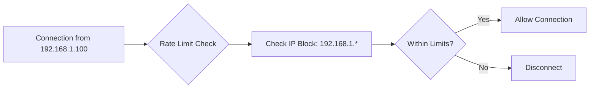
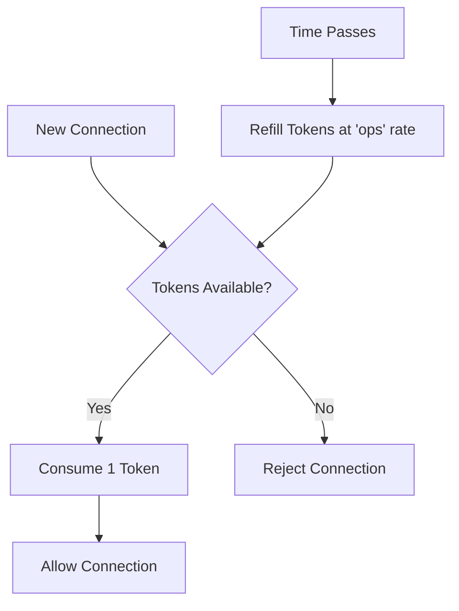

# Rate Limiting

Rate limiting is an important mechanism for controlling resource utilization and managing quality of service. Gate includes built-in rate limiters to protect your network from abuse and attacks.

## Overview

Gate provides IP-based rate limiting to prevent aggressive connection attempts and API flooding. The rate limiters operate at the network edge, disconnecting excessive connections before they consume server resources.

<Info>
Rate limiting configuration is found under the `quota` section of your `config.yml`.
</Info>

## Rate Limiter Types

Gate includes two types of rate limiters:

### Connection Limiter

Triggered upfront on any new connection attempt, before any authentication or data processing.

**Purpose**: Prevents connection flooding and protects server resources

### Login Limiter

Triggered just before authenticating a player with Mojang's authentication servers.

**Purpose**: Prevents flooding the Mojang API and protects against authentication abuse

## How It Works

Each rate limiter is **IP block based**, cutting off the last numbers (/24 block) as in `255.255.255.xxx`.



Too many connections from the same IP block (as configured) will be simply disconnected.

<Tip>
The default settings should never affect legitimate players and only rate limit aggressive behaviors.
</Tip>

## Configuration

### Basic Configuration

Rate limiting is configured under the `quota` section in `config.yml`:

```yaml
config:
  quota:
    # Connection rate limiter
    connections:
      enabled: true
      ops: 5          # Operations per second allowed
      burst: 10       # Maximum burst operations
      maxEntries: 1000 # Maximum IP blocks to track

    # Login rate limiter
    logins:
      enabled: true
      ops: 0.4        # Operations per second (1 every 2.5 seconds)
      burst: 3        # Allow burst of 3 logins
      maxEntries: 1000 # Maximum IP blocks to track
```

### Connection Limiter Settings

| Setting | Description | Default | Recommended |
| --- | --- | --- | --- |
| `enabled` | Enable connection rate limiting | `true` | `true` |
| `ops` | Operations per second allowed per IP block | `5` | `3-10` |
| `burst` | Maximum burst operations | `10` | `5-15` |
| `maxEntries` | Maximum IP blocks to track in cache | `1000` | `1000-5000` |

### Login Limiter Settings

| Setting | Description | Default | Recommended |
| --- | --- | --- | --- |
| `enabled` | Enable login rate limiting | `true` | `true` |
| `ops` | Operations per second allowed per IP block | `0.4` | `0.4-1.0` |
| `burst` | Maximum burst operations | `3` | `2-5` |
| `maxEntries` | Maximum IP blocks to track in cache | `1000` | `1000-5000` |

## Understanding Parameters

### Operations Per Second (ops)

The sustained rate of operations allowed from an IP block:

- **Connection limiter**: `ops: 5` means 5 connections per second
- **Login limiter**: `ops: 0.4` means 1 login every 2.5 seconds (0.4 = 1/2.5)

### Burst

The maximum number of operations that can happen in a short time window:

- Allows temporary spikes in legitimate traffic
- One burst unit is refilled per second
- Example: `burst: 10` allows up to 10 rapid connections, then enforces `ops` rate

### Max Entries

The maximum number of unique IP blocks to track:

- When full, oldest entries are evicted
- Higher values = more memory usage but better tracking
- Should be sized based on expected unique IPs

## Example Configurations

### Small Server (< 50 players)

```yaml
quota:
  connections:
    enabled: true
    ops: 3
    burst: 5
    maxEntries: 500
  logins:
    enabled: true
    ops: 0.5
    burst: 2
    maxEntries: 500
```

### Medium Server (50-200 players)

```yaml
quota:
  connections:
    enabled: true
    ops: 5
    burst: 10
    maxEntries: 1000
  logins:
    enabled: true
    ops: 0.4
    burst: 3
    maxEntries: 1000
```

### Large Server (200+ players)

```yaml
quota:
  connections:
    enabled: true
    ops: 10
    burst: 15
    maxEntries: 5000
  logins:
    enabled: true
    ops: 1.0
    burst: 5
    maxEntries: 5000
```

### Development/Testing

```yaml
quota:
  connections:
    enabled: true
    ops: 20
    burst: 50
    maxEntries: 100
  logins:
    enabled: false  # Disable for faster testing
```

## Rate Limiting Behavior

### Token Bucket Algorithm

Gate uses a token bucket algorithm for rate limiting:

1. Each IP block has a bucket with `burst` tokens
2. Each operation consumes 1 token
3. Tokens refill at `ops` rate per second
4. If bucket is empty, connection is rejected



### What Gets Rate Limited

**Connection Limiter** applies to:
- Initial TCP connections
- Handshake attempts
- Status ping requests
- Any new connection attempt

**Login Limiter** applies to:
- Mojang authentication requests
- Premium account validation
- Online mode login attempts

## Tuning for Your Network

### Symptoms of Too Strict Limits

- Legitimate players getting disconnected
- "Connection throttled" messages in logs
- Players unable to join during peak times

**Solution**: Increase `ops` and `burst` values

### Symptoms of Too Lenient Limits

- Successful bot attacks
- Server resource exhaustion
- Lag spikes during connection floods

**Solution**: Decrease `ops` and `burst` values

### Monitoring

Check your Gate logs for rate limiting events:

```log
[WARN] Connection from 192.168.1.* exceeded rate limit, dropping connection
[WARN] Login attempt from 10.0.0.* exceeded rate limit, denying authentication
```

## DDoS Protection

<Warning>
Rate limiting only prevents attacks on a per-IP-block basis and **cannot mitigate distributed denial of service (DDoS)** attacks, since this type of attack should be handled at a higher networking layer than Gate operates.
</Warning>

For comprehensive DDoS protection:

1. **Use rate limiting** - Protects against single-IP abuse
2. **Implement network-level filtering** - Firewall rules, DDoS mitigation services
3. **Use proxy services** - Cloudflare, TCPShield, or similar
4. **Configure connection limits** - At OS level (ulimit, iptables)

<Info>
See the [DDoS Protection guide](/guide/security/ddos) for comprehensive server protection strategies.
</Info>

## Best Practices

<CardGroup cols={2}>
  <Card title="Start Conservative" icon="gauge-simple-low">
    Begin with default settings and adjust based on actual traffic patterns
  </Card>
  
  <Card title="Monitor Logs" icon="chart-line">
    Regularly check logs for rate limiting events to tune settings
  </Card>
  
  <Card title="Test Changes" icon="flask">
    Test rate limit changes in development before deploying to production
  </Card>
  
  <Card title="Consider Network Size" icon="users">
    Scale `maxEntries` based on expected unique IP addresses
  </Card>
</CardGroup>

### Recommended Practices

1. **Enable both limiters** - Connection and login protection work together
2. **Set realistic bursts** - Allow for legitimate connection spikes
3. **Monitor and adjust** - Fine-tune based on real-world traffic
4. **Document changes** - Keep notes on why you adjusted limits
5. **Layer defenses** - Combine rate limiting with other security measures

## Troubleshooting

### Legitimate Players Being Rate Limited

**Cause**: Settings too strict for your player base

**Solution**:
```yaml
quota:
  connections:
    ops: 10  # Increase from 5
    burst: 20  # Increase from 10
```

### Bots Still Getting Through

**Cause**: Settings too lenient

**Solution**:
```yaml
quota:
  connections:
    ops: 2  # Decrease from 5
    burst: 3  # Decrease from 10
```

### Players from Large Networks Blocked

**Cause**: Many players sharing same /24 IP block (schools, offices)

**Solution**:
```yaml
quota:
  connections:
    burst: 30  # Higher burst for legitimate shared IPs
```

### Mojang Authentication Failures

**Cause**: Login limiter too strict

**Solution**:
```yaml
quota:
  logins:
    ops: 1.0  # Increase from 0.4
    burst: 5  # Increase from 3
```

## Advanced Configuration

### Disable Rate Limiting

For development or trusted environments:

```yaml
quota:
  connections:
    enabled: false
  logins:
    enabled: false
```

<Warning>
Never disable rate limiting in production environments exposed to the internet.
</Warning>

### Very Strict Protection

For servers under heavy attack:

```yaml
quota:
  connections:
    enabled: true
    ops: 1
    burst: 2
    maxEntries: 10000
  logins:
    enabled: true
    ops: 0.1  # 1 login per 10 seconds
    burst: 1
    maxEntries: 10000
```

## Performance Impact

Rate limiting has minimal performance overhead:

- **Memory**: ~100 bytes per tracked IP block
- **CPU**: Negligible (simple token bucket operations)
- **Latency**: < 1ms additional per connection

Example memory usage:
- 1,000 entries ≈ 100 KB
- 5,000 entries ≈ 500 KB
- 10,000 entries ≈ 1 MB

## Summary

Rate limiting is a critical security feature that:

- Protects against connection floods
- Prevents Mojang API abuse
- Maintains server performance
- Blocks single-source attacks

Configure it appropriately for your network size and threat model, and monitor logs to ensure legitimate players aren't affected.
