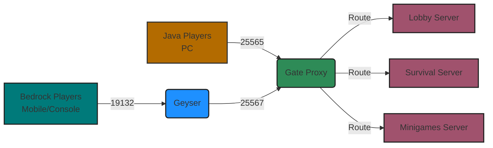

## What is Gate?

Gate is a **modern, extensible Minecraft proxy server** that connects players to your backend servers while providing powerful features like cross-server chat, seamless server switching, and network-wide plugins.

Built entirely in **Go** and inspired by Velocity, Gate brings enterprise-grade performance to Minecraft server networks of any size - from small personal networks to large-scale cloud deployments.

<Card title="Key Features" icon="star">
  - **Minimal Resource Footprint**: Only ~10MB RAM usage
  - **Broad Version Support**: Minecraft 1.7 to latest versions
  - **Built-in Bedrock Support**: Cross-play with mobile, console, and Windows players
  - **Cloud-Native Design**: Deploy anywhere from local machines to Kubernetes
  - **Modern Go Architecture**: Fast compilation, single binary distribution
</Card>

## Why Use a Minecraft Proxy?

A Minecraft proxy sits between players and your game servers, acting as an intelligent router and middleware layer:

<CardGroup cols={2}>
  <Card title="Seamless Server Switching" icon="arrows-turn-right">
    Move players between servers instantly without disconnecting. Perfect for lobby systems, minigames, and multi-world networks.
  </Card>
  
  <Card title="Network-Wide Features" icon="network-wired">
    Implement cross-server chat, global commands, unified permission systems, and network-wide player management.
  </Card>
  
  <Card title="Cross-Platform Play" icon="mobile">
    Enable Java Edition (PC) and Bedrock Edition (Mobile, Console, Windows) players to play together with built-in Geyser integration.
  </Card>
  
  <Card title="Advanced Monitoring" icon="chart-line">
    Inspect network traffic, analyze player behavior, monitor performance, and audit security - all from a single point.
  </Card>
</CardGroup>

## How Gate Works

Gate operates as middleware between your players and backend Minecraft servers:

<Steps>
  <Step title="Players Connect to Gate">
    Players connect to Gate's address (e.g., `play.yourserver.com:25565`) just like connecting to a normal Minecraft server.
  </Step>
  
  <Step title="Gate Routes Connections">
    Gate authenticates players and forwards connections to your actual game servers (Vanilla, Paper, Spigot, Fabric, etc.) based on your configuration.
  </Step>
  
  <Step title="Seamless Server Transfers">
    Players can move between backend servers while maintaining their connection to Gate - no disconnects or re-authentication needed.
  </Step>
  
  <Step title="Events & Plugins">
    Gate monitors all network traffic and emits events for login, logout, server connections, chat messages, kicks, and more - enabling powerful plugins.
  </Step>
</Steps>

<Note>
  Gate doesn't replace your game servers - it sits in front of them. You still need backend Minecraft servers (Paper, Spigot, Vanilla, etc.) running your worlds and gameplay logic.
</Note>

## Gate vs BungeeCord vs Velocity

Gate is designed as a modern alternative to traditional Java-based proxies:

| Feature | Gate | BungeeCord | Velocity |
|---------|------|------------|----------|
| Language | Go | Java | Java |
| Memory Usage | ~10MB | ~50-100MB | ~50-100MB |
| Version Support | 1.7 - Latest | 1.7 - Latest | 1.7 - Latest |
| Bedrock Built-in | ✅ Yes | ❌ Plugin | ❌ Plugin |
| Plugin System | Go SDK | Java Plugins | Java Plugins |
| Cloud-Native | ✅ Yes | Limited | Limited |
| Single Binary | ✅ Yes | ❌ JAR + Java | ❌ JAR + Java |
| Lite Mode | ✅ Yes | ❌ No | ❌ No |

<Warning>
  Gate does **not** support BungeeCord or Velocity plugins. If you have existing Java plugins you depend on, you may want to stick with those platforms. Gate uses Go for extensions and plugins.
</Warning>

## Who is Gate For?

<CardGroup cols={2}>
  <Card title="Server Networks" icon="server">
    Perfect for networks serving hundreds or thousands of concurrent players who need custom functionality and horizontal scalability.
  </Card>
  
  <Card title="Go Developers" icon="code">
    Ideal for developers who want to leverage Go's performance, concurrency model, and ecosystem for Minecraft infrastructure.
  </Card>
  
  <Card title="Cloud Deployments" icon="cloud">
    Built for modern infrastructure with Kubernetes support, health checks, metrics, and cloud-native patterns.
  </Card>
  
  <Card title="Cross-Play Networks" icon="gamepad">
    Enable Java and Bedrock players to play together with zero backend plugins required.
  </Card>
</CardGroup>

## Why Go?

Gate leverages Go's strengths to deliver exceptional performance and developer experience:

- **Fast Compilation**: Build and deploy in seconds, not minutes
- **Single Binary**: No runtime dependencies - just copy and run
- **Excellent Concurrency**: Handle thousands of connections efficiently
- **Modern Tooling**: Simple dependency management with Go modules
- **Cloud Integration**: First-class support for Docker, Kubernetes, and cloud platforms
- **Battle-Tested**: Go powers infrastructure at Google, Microsoft, Meta, Amazon, Netflix, and more

<Info>
  Gate is written in [Go](https://go.dev/), a modern programming language designed by Google for building reliable, efficient software at scale.
</Info>

## Special Features

### Bedrock Cross-Play

Gate includes **built-in Bedrock Edition support** through integrated Geyser and Floodgate technology:

- Enable Java and Bedrock players on the same network
- Zero plugins required on backend servers
- Automatic protocol translation
- Managed or manual Geyser modes

See the [Bedrock Guide](/guide/bedrock) for setup instructions.

### Lite Mode

Gate Lite Mode is a **lightweight reverse proxy** that routes players based on the hostname they connect with:

- Expose multiple servers through a single port
- Perfect for simple setups or proxy-behind-proxy architectures
- Minimal overhead and resource usage
- Support for load balancing strategies

See the [Lite Mode Guide](/guide/lite) for more information.

### Connect Network

Gate integrates with [Minekube Connect](https://connect.minekube.com/) - a network that makes Minecraft servers universally accessible:

- Players can join locally hosted servers without port forwarding
- No public IP address required
- Additional network services and community features

## Next Steps

<CardGroup cols={2}>
  <Card title="Quick Start" icon="rocket" href="/quickstart">
    Install and configure Gate in minutes
  </Card>
  
  <Card title="Why Gate?" icon="circle-question" href="/why-gate">
    Learn why Gate might be the right choice for your network
  </Card>
  
  <Card title="Configuration" icon="gear" href="/guide/config">
    Explore all configuration options
  </Card>
  
  <Card title="Developer Guide" icon="code" href="/developers">
    Extend Gate with custom functionality
  </Card>
</CardGroup>
